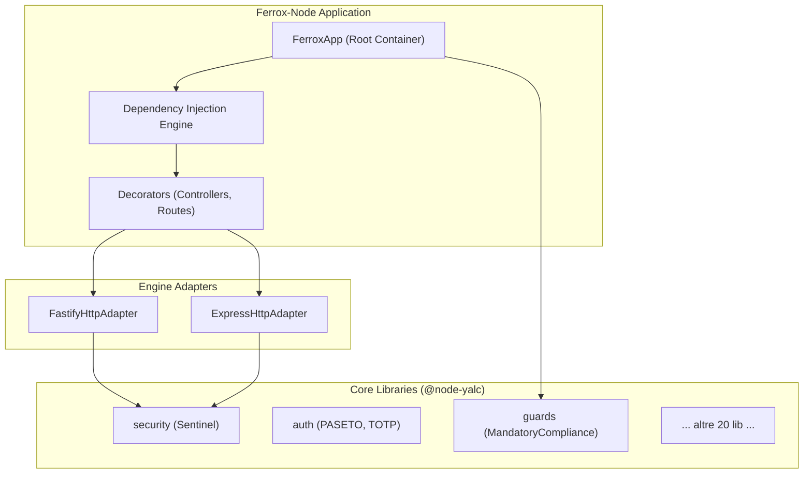

# `@ferrox-node/core`

> **Ferrox-Node**: High-performance, Standalone Enterprise Security & Web Framework for Node.js / TypeScript. Built-in Dual Fastify & Express Engine Adapters, PASETO v4 Security, TOTP 2FA, Mandatory Kernel Compliance Guards, and Sentinel AI/LSM Guardrails.

`@ferrox/node` is the complete Node.js/TypeScript port of the Rust **Ferrox** kernel & security ecosystem (`ferrox-backend`). It operates as a standalone framework without requiring external web framework dependencies.

---

## 1. 🧠 Philosophy & Purpose

L'obiettivo principale di `@ferrox-node/core` è fornire un framework web backend "Secure by Default" e "AI-Ready". A differenza dei framework tradizionali che delegano la sicurezza a middleware esterni, Ferrox integra nativamente controlli di Mandatory Compliance, cifratura PASETO, isolamento a livello Kernel e un AI Guardrail (Sentinel) che protegge dai moderni vettori di attacco (Prompt Injection, RAG Poisoning, ecc.).

## 2. 🧅 Architectural Layering

L'architettura di `ferrox-node` si poggia interamente sui 23 pacchetti del sottomodulo `@node-yalc`, estendendoli con la Dependency Injection e gli Engine Adapter:

## 3. ⚙️ How it Works

Ferrox-Node implementa un pattern **Adapter**. In fase di inizializzazione dell'app (`FerroxApp`), puoi scegliere se utilizzare il motore `fastify` o `express`. Il framework inietta autonomamente il container DI, registra i controller annotati con i decoratori (es. `@Controller`, `@Get`), ed aggancia il ciclo di vita (OnModuleInit) applicando globalmente le security guard, tra cui la `MandatoryComplianceGuard`.

## 4. 📐 Why it was designed this way

- **Sicurezza Intrinseca**: Impossibile avviare il server se i check di sicurezza falliscono (es. config errata o missing security headers).
- **Astrazione del Motore**: Poter passare da `express` (per compatibilità con ecosistemi legacy) a `fastify` (per massime prestazioni e validazione schemi JSON) senza cambiare una sola riga di business logic.
- **Isolamento dell'AI**: L'infrastruttura Sentinel rileva pattern di anomalie sulle request bloccandole prima che l'engine HTTP le elabori, riducendo l'impatto delle vulnerabilità logiche.

## 5. 📖 Usage Guide & Code Examples

### Avvio Veloce
\`\`\`typescript
import { FerroxApp, Controller, Get, Post, UseGuard, MandatoryComplianceGuard } from '@ferrox-node/core';

@Controller('/api/v1')
@UseGuard(new MandatoryComplianceGuard())
export class ApiController {
  @Get('/status')
  getStatus() {
    return { status: 'UP', framework: 'Ferrox-Node v0.2.1' };
  }
}

// Bootstrap dell'app con motore Fastify
const app = new FerroxApp({
  engine: 'fastify', // o 'express'
  port: 8080,
  controllers: [new ApiController()],
});

app.start();
\`\`\`

### Integrazione Auth & Config
Tutte le estensioni, come \`FerroxConfigService\` e la suite PASETO, sono esposte e pronte per l'injected dependencies. Non c'è bisogno di configurare istanze multiple; il container centrale gestisce l'albero delle dipendenze al caricamento dei controller.

## 6. ⚠️ Anti-Patterns (Cosa NON fare)

- ❌ **Scavalcare l'Adapter**: Mai usare istanze di `app.express()` direttamente per iniettare logiche di business non tipizzate. Utilizza sempre i decoratori (`@Get`, `@Post`) per garantire che i guard di compliance vengano applicati alla rotta.
- ❌ **Disabilitare la ComplianceGuard**: La `MandatoryComplianceGuard` non va disabilitata in produzione; controlla HSTS, CSP, e nosniff header. Toglierla rende vana la sicurezza intrinseca del framework.
- ❌ **Re-inventare Token Security**: Evitare librerie JWT esterne; sfrutta l'engine integrato PASETO v4 (`@node-yalc/auth`) per token immuni agli attacchi asimmetrici di downgrade.

## 7. 💡 Pro-Tips & Best Practices

- **Performance con Fastify**: Prediligi sempre l'engine `fastify` in ambienti di produzione per beneficiare dello schema-driven serialization. 
- **Landlock Kernel Sandbox**: Negli ambienti Linux, integra la chiamata a `KernelSandboxService` dal modulo `kernel` prima dell'avvio HTTP, per limitare i permessi del processo ai soli path necessari.
- **Logging Asincrono**: Usa `tracing-logger` iniettato per assicurarti che il logger Pino giri in thread separati e non blocchi l'Event Loop durante l'analisi entropica delle request AI.

