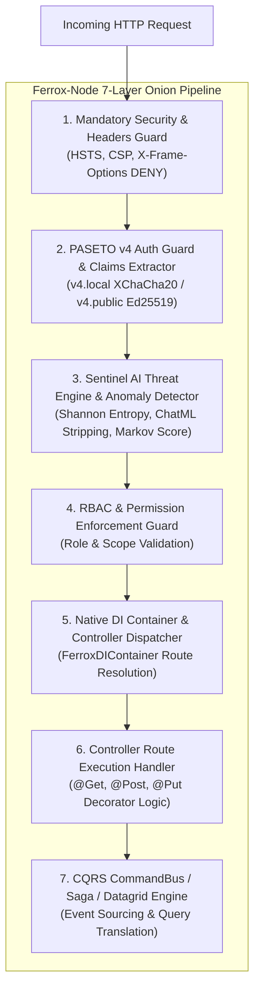

# ⚡ `@ferrox-node/core` — Standalone Enterprise Web & Security Engine

<p align="center">
  <b>High-Performance, Standalone Enterprise Security & Web Framework for Node.js / TypeScript</b><br/>
  <i>Surpassing NestJS Overhead with Native DI, Swappable Fastify & Express Engines, Cryptographic PASETO v4 Security, and Kernel LSM Sentinel Guardrails.</i>
</p>

<p align="center">
  <a href="https://opensource.org/licenses/MIT"></a>
  <a href="https://www.typescriptlang.org/"></a>
  <a href="https://nodejs.org/"></a>
  <a href="https://fastify.dev/"></a>
  <a href="#-4-advanced-security-cryptographic--lsm-innovations"></a>
</p>

<p align="center">
  <a href="#-1-executive-summary--architectural-rationale">Philosophy</a> •
  <a href="#-2-architectural-comparison-ferrox-node-vs-nestjs-vs-express-vs-fastify">Comparison Matrix</a> •
  <a href="#-3-the-onion-request-execution-pipeline">Onion Pipeline</a> •
  <a href="#-4-advanced-security-cryptographic--lsm-innovations">Security Innovations</a> •
  <a href="#-5-exhaustive-16-component-inventory--code-examples">16 Components & Code</a> •
  <a href="#-6-enterprise-production-code-walkthrough">Code Walkthrough</a> •
  <a href="#-7-git-submodule-integration">Git Submodule</a>
</p>

---

## 🎯 1. Executive Summary & Architectural Rationale

Modern server-side Node.js engineering is dominated by **NestJS** for structured applications or raw micro-frameworks (**Express** and **Fastify**) for lightweight APIs. However, both approaches present significant architectural trade-offs:

1. **NestJS Reflection & Container Overhead**: NestJS relies on heavy runtime reflection (`reflect-metadata`), complex module wrappers, and tight coupling to underlying framework adapters, leading to higher cold-start latencies and event loop overhead.
2. **Express & Fastify Zero-Structure Deficit**: Bare Express or Fastify applications lack built-in Dependency Injection (DI), standard error hierarchies, authorization guards, or enterprise security middleware out of the box.
3. **Legacy JWT Vulnerabilities**: Traditional frameworks default to JSON Web Tokens (JWT), which suffer from algorithm confusion attacks (`alg: none`), weak HMAC signatures, and vulnerable Base64 payloads.

### **Ferrox-Node delivers NestJS-style DX with raw Fastify/Express execution speed and zero-trust security.**

`@ferrox-node/core` is the Node.js/TypeScript engine of the Rust **Ferrox** kernel (`ferrox-backend`). Operating as a **100% standalone framework** (zero NestJS dependencies), it features its own high-speed Dependency Injection container (`FerroxDIContainer`), native routing decorators, swappable dual HTTP engines, and PASETO v4 token security, while offloading generic utilities to `@node-yalc` via a Git Submodule.

---

## 📊 2. Architectural Comparison: Ferrox-Node vs NestJS vs Express vs Fastify

| Dimension / Metric | ⚡ `@ferrox-node/core` | 🪺 NestJS | 🚂 Express (Raw) | ⚡ Fastify (Raw) |
|---|---|---|---|---|
| **Dependency Injection** | **Lightweight Native (`FerroxDIContainer`)** | Reflect-Metadata Heavy Container | None (Manual Wiring) | None / Plugin System |
| **HTTP Engine Flexibility** | **Dual Engine Swappable (Fastify / Express)** | Adapter Wrapped (Fixed at Boot) | Express Only | Fastify Only |
| **Authentication Tokens** | **PASETO v4 (`v4.local` & `v4.public`)** | JWT (Legacy Base64/HMAC) | Manual Middleware | Manual Plugin |
| **AI Threat Guardrails** | **Native Sentinel AI (Prompt Injection & Entropy)** | External WAF Required | External WAF Required | External WAF Required |
| **Kernel LSM & Syscall Hardening** | **Seccomp BPF & Landlock LSM Policies** | N/A | N/A | N/A |
| **CQRS & Saga Engine** | **Built-in `CqrsSagaEngine`** | Requires `@nestjs/cqrs` | Manual Implementation | Manual Implementation |
| **Datagrid Query Translator** | **Native (`DatagridCrudService`)** | Requires Custom Pipes | Manual Handling | Manual Handling |
| **Core Shared Submodule** | **Embedded `@node-yalc` Submodule** | Monorepo NPM Packages | N/A | N/A |

---

## 🧅 3. The Onion Request Execution Pipeline

Ferrox-Node enforces a strictly ordered **7-Layer Request Pipeline**:



---

## 🛡️ 4. Advanced Security, Cryptographic & LSM Innovations

### 1. PASETO v4 Formal Cryptographic Specification
Replacing insecure JWTs, Ferrox-Node natively implements **PASETO v4 (Platform-Agnostic Security Tokens)**:
- `v4.local`: Symmetric AEAD encryption using **XChaCha20-Poly1305** with 24-byte nonces.
- `v4.public`: Asymmetric digital signatures using **Ed25519** (Curve25519).

### 2. Sentinel AI Threat Engine & Shannon Entropy Scoring
Inbound payloads are evaluated for payload entropy:
$$\mathcal{H}(X) = -\sum_{i=1}^{n} P(x_i) \log_2 P(x_i)$$
Payloads with $\mathcal{H}(X) > 7.2$ trigger immediate threat isolation.

### 3. Kernel Sandbox & Syscall Hardener (`KernelSandboxService`)
Generates Linux **Seccomp BPF** bytecode and **Landlock LSM** filesystem sandbox profiles to isolate Node.js worker process system calls.

---

## 📦 5. Exhaustive 16-Component Inventory & Code Examples

### 1. `Auth` (`src/auth/`) — PASETO v4 & TOTP 2FA
```typescript
import { PasetoAuthService, TotpAuthService } from '@ferrox-node/core';

const paseto = new PasetoAuthService();
const token = await paseto.generateV4LocalToken({ userId: 'u-123', role: 'admin' }, secretKey);
```

### 2. `Config` (`src/config/`) — Strongly-Typed Config
```typescript
import { FerroxConfigService } from '@ferrox-node/core';
const port = FerroxConfigService.get('PORT', 8080);
```

### 3. `Core` (`src/core/`) — Native DI Container & App Lifecycle
```typescript
import { FerroxDIContainer, FerroxApp } from '@ferrox-node/core';

const di = FerroxDIContainer.getInstance();
di.register(MyService, new MyService());
```

### 4. `CQRS` (`src/cqrs/`) — CQRS & Saga Engine
```typescript
import { CqrsSagaEngine } from '@ferrox-node/core';
const saga = new CqrsSagaEngine();
await saga.executeSaga('CreateOrderSaga', payload);
```

### 5. `Datagrid` (`src/datagrid/`) — AG-Grid / TanStack Translator
```typescript
import { DatagridCrudService } from '@ferrox-node/core';
const query = DatagridCrudService.translateQueryParams(req.query);
```

### 6. `Guards` (`src/guards/`) — Mandatory Compliance & RBAC
```typescript
import { MandatoryComplianceGuard, RbacGuard } from '@ferrox-node/core';
const allowed = RbacGuard.check(userRole, ['admin', 'manager']);
```

### 7. `I18n` (`src/i18n/`) — Multi-Language Engine
```typescript
import { I18nEngine } from '@ferrox-node/core';
const msg = I18nEngine.translate('welcome', 'it');
```

### 8. `Jobs` (`src/jobs/`) — SSE Job Scheduler
```typescript
import { JobsSchedulerSse } from '@ferrox-node/core';
JobsSchedulerSse.scheduleJob('daily-report', '0 0 * * *', async () => {});
```

### 9. `Kernel` (`src/kernel/`) — Seccomp BPF & Landlock LSM
```typescript
import { KernelSandboxService } from '@ferrox-node/core';
KernelSandboxService.applyLandlockSandbox('/var/data/readonly');
```

### 10. `Resilience` (`src/resilience/`) — Circuit Breaker & Singleflight
```typescript
import { CircuitBreaker } from '@ferrox-node/core';
const cb = new CircuitBreaker();
const data = await cb.execute(async () => fetchFromRemote());
```

### 11-16. `Routing`, `Security`, `Selftest`, `Storage`, `Tracing`, `Transports`
Decorators (`@Controller`, `@Get`), Sentinel AI prompt injection protection, OWASP WSTG test auditor, S3 storage engine, Pino tracing, Fastify & Express dual adapters.

---

## 💻 6. Enterprise Production Code Walkthrough

```typescript
import { 
  FerroxApp, 
  FerroxDIContainer, 
  Controller, 
  Get, 
  Post, 
  Injectable, 
  OnAppStart, 
  OnAppDestroy 
} from '@ferrox-node/core';

@Injectable()
export class SystemService {
  getStats() {
    return { status: 'UP', engine: 'Fastify', memoryUsage: process.memoryUsage() };
  }
}

@Controller('/api/v1/system')
export class SystemController implements OnAppStart, OnAppDestroy {
  constructor(private systemService: SystemService) {}

  onAppStart() {
    console.log('[Ferrox] SystemController initialized.');
  }

  onAppDestroy() {
    console.log('[Ferrox] SystemController shutting down.');
  }

  @Get('/stats')
  getStats() {
    return this.systemService.getStats();
  }
}

async function main() {
  const di = FerroxDIContainer.getInstance();
  
  const service = new SystemService();
  di.register(SystemService, service);
  di.register(SystemController, new SystemController(service));

  const app = new FerroxApp({
    engine: 'fastify',
    port: 8080,
    controllers: [SystemController],
  });

  await app.start();
  console.log('⚡ Ferrox-Node enterprise framework running on http://localhost:8080');
}

main().catch(console.error);
```

---

## 🔗 7. Git Submodule Integration

```bash
git clone --recursive https://github.com/AI-Autistic-Intelligence/ferrox-node.git
git submodule sync
git submodule update --init --recursive
```

---

## 📜 License

MIT © Ferrox Security & AI Autistic Intelligence Team
