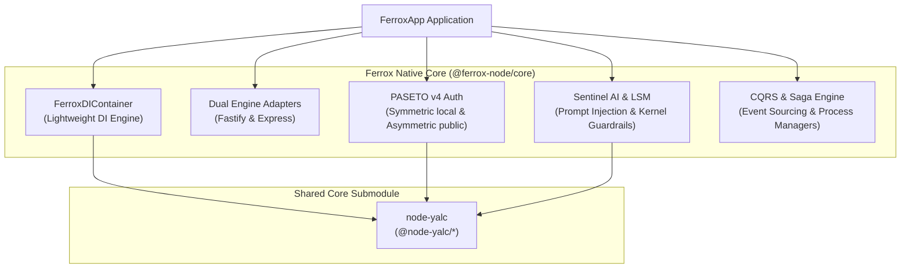

# `@ferrox-node/core` — Standalone Enterprise Security & Web Framework

> **Ferrox-Node**: High-performance, Standalone Enterprise Security & Web Framework for Node.js / TypeScript. Features Dual Fastify & Express Engine Adapters, PASETO v4 Crypto Tokens, TOTP 2FA, Mandatory Kernel Compliance Guards, CQRS Sagas, and Sentinel AI / LSM Guardrails.

[](https://opensource.org/licenses/MIT)
[](https://www.typescriptlang.org/)
[](https://nodejs.org/)

---

## 🚀 Architecture & Overview

`@ferrox-node/core` is the Node.js/TypeScript engine of the Rust **Ferrox** kernel & security ecosystem (`ferrox-backend`). It functions as a complete **standalone web framework**—it does not rely on NestJS or external abstractions. It uses its own lightweight Dependency Injection container, native decorators, and lifecycle handlers, while pulling pure shared core utilities from `@node-yalc` via a Git Submodule.



---

## 🌟 Key Features

### 1. Dual HTTP Engines (Fastify & Express)
Switch seamlessly between `fastify` (for extreme HTTP/2 throughput and JSON schema validation) and `express` (for legacy middleware compatibility) by changing a single configuration property:
```typescript
const app = new FerroxApp({
  engine: 'fastify', // 'fastify' | 'express'
  port: 8080,
  controllers: [ApiController]
});
```

### 2. PASETO v4 Token Authentication (`PasetoAuthService`)
Replaces legacy JWTs with cryptographically secure **PASETO v4**:
- `v4.local`: Symmetric AEAD encryption (XChaCha20-Poly1305).
- `v4.public`: Asymmetric digital signatures (Ed25519).

### 3. Mandatory Compliance Guard (`MandatoryComplianceGuard`)
Enforces mandatory security headers (`X-Content-Type-Options: nosniff`, `X-Frame-Options: DENY`, `Strict-Transport-Security`, `Content-Security-Policy`), payload integrity signatures, and strict request boundaries.

### 4. Sentinel AI & Kernel LSM Guardrails (`SentinelIntegrationService`)
Provides advanced runtime security defense:
- **AI Security**: Prompt injection detection, ChatML tag stripping, and RAG hallucination scoring.
- **Payload Anomaly Analysis**: Shannon entropy scoring and Markov sequence anomaly prediction.
- **Kernel Guardrails**: Seccomp BPF & Landlock LSM policy generation, LSASS process handle telemetry, and sysctl hardening verification.

### 5. CQRS & Saga Engine (`CqrsSagaEngine`)
In-memory and distributed Command-Query Responsibility Segregation with Saga process managers for handling complex, multi-step distributed workflows.

---

## 💡 Code Example: Building a Secure Microservice

```typescript
import { 
  FerroxApp, 
  FerroxDIContainer, 
  Controller, 
  Get, 
  Post, 
  Injectable, 
  OnAppStart, 
  OnAppDestroy 
} from '@ferrox-node/core';

// 1. Define Service
@Injectable()
export class AuthService {
  async validateToken(token: string) {
    return { valid: true, userId: 'user-123', role: 'admin' };
  }
}

// 2. Define Controller
@Controller('/api/v1/auth')
export class AuthController implements OnAppStart, OnAppDestroy {
  constructor(private authService: AuthService) {}

  onAppStart() {
    console.log('[Ferrox] AuthController initialized.');
  }

  onAppDestroy() {
    console.log('[Ferrox] AuthController shutting down.');
  }

  @Get('/status')
  getStatus() {
    return { status: 'OPERATIONAL', framework: 'Ferrox-Node', security: 'PASETO v4' };
  }

  @Post('/verify')
  async verify(req: any) {
    return await this.authService.validateToken(req.body.token);
  }
}

// 3. Bootstrap Application
async function main() {
  const di = FerroxDIContainer.getInstance();
  
  // Register dependencies
  const authService = new AuthService();
  di.register(AuthService, authService);
  di.register(AuthController, new AuthController(authService));

  const app = new FerroxApp({
    engine: 'fastify',
    port: 3000,
    controllers: [AuthController],
  });

  await app.start();
  console.log('🚀 Ferrox-Node service running on http://localhost:3000');
}

main().catch(console.error);
```

---

## 🛠️ Build & Submodule Integration

```bash
# Compile TypeScript to dist/
npm run build

# Update node-yalc submodule
git submodule update --init --recursive
```

---

## 📜 Ecosystem Overview

- **`@ferrox-node/core`**: Primary standalone web framework, DI, PASETO authentication, and security guardrails.
- **`@node-yalc/*`**: Pure, framework-agnostic shared core utilities embedded via Git Submodule.
- **`@nest-yalc-2/*`**: NestJS-specific bindings when integrating with NestJS applications.

---

## 📜 License

MIT © Ferrox Security & AI Autistic Intelligence Team
