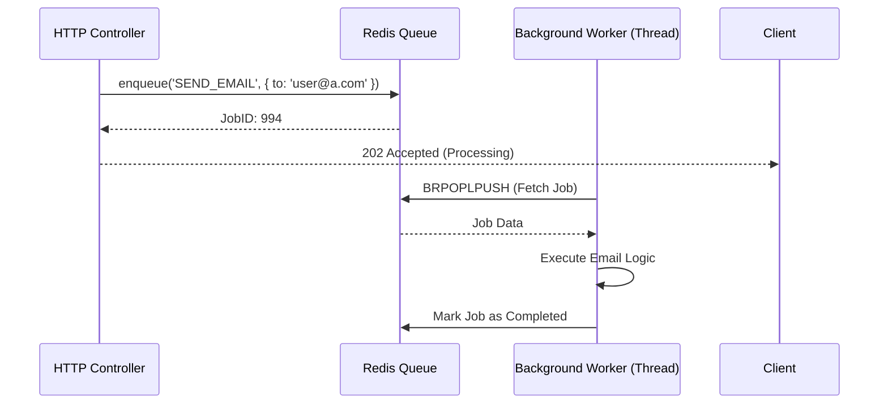

# ⚙️ Background Jobs & Workers (`@ferrox-node/jobs`)

## 💡 1. What It Is & Architectural Purpose
The Background Jobs module provides a robust, distributed task execution engine for `@ferrox-node`. Its architectural purpose is to offload heavy computations, long-running processes (like video encoding or report generation), and asynchronous tasks (like email sending) away from the main HTTP event loop. This ensures the API remains highly responsive.

---

## ⚙️ 2. Comprehensive Taxonomy & Key Features

| Component | Description | Use Case |
| :--- | :--- | :--- |
| **`JobScheduler`** | Cron-based scheduler for recurring tasks. | Nightly database cleanups. |
| **`WorkerPool`** | Thread-pool manager using `worker_threads`. | CPU-intensive tasks (image resizing). |
| **`RedisQueueAdapter`** | Distributed queue powered by BullMQ/Redis. | Guaranteed execution across multi-node clusters. |

---

## 🔬 3. How It Works Under the Hood

When a Controller enqueues a job, it is immediately serialized and pushed to a Redis-backed queue. A separate fleet of Worker processes constantly polls this queue.



This guarantees **At-Least-Once** delivery and handles automatic retries with exponential backoff on failure.

---

## 🧠 4. Why It Was Designed This Way (Rationale)

Node.js is single-threaded by nature. If you process a 5-second report generation on the main thread, the entire API freezes for all other users for 5 seconds. By using `@ferrox-node/jobs`, we utilize both Redis (for horizontal scaling across multiple pods) and `worker_threads` (for vertical scaling across CPU cores), achieving enterprise-grade concurrency.

---

## 🚀 5. Usage Guide & Code Examples

### Defining and Dispatching a Job

```typescript
import { Process, Processor, InjectQueue, Queue } from '@ferrox-node/jobs';

// 1. Define the Worker Processor
@Processor('email-queue')
export class EmailWorker {
  
  @Process('send-welcome')
  async handleWelcomeEmail(job: Job<{ email: string }>) {
    console.log(`Sending email to ${job.data.email}...`);
    // Simulated heavy task
    await new Promise(r => setTimeout(r, 2000));
    console.log('Email sent!');
  }
}

// 2. Dispatch the Job from a Controller
@Controller('/users')
export class UserController {
  constructor(@InjectQueue('email-queue') private emailQueue: Queue) {}

  @Post('/register')
  async register() {
    // Return instantly to user
    await this.emailQueue.add('send-welcome', { email: 'new@user.com' });
    return { status: 'Registration pending' };
  }
}
```

---

## ⚠️ 6. Anti-Patterns: How NOT to Use It

> [!WARNING]
> **Anti-Pattern 1: Passing Rich Objects in Job Data**
> Never pass full class instances, TypeORM Entities, or database connections into the job payload. The payload must be serializable to pure JSON. Pass the ID instead, and let the worker fetch the data from the database.

> [!CAUTION]
> **Anti-Pattern 2: Infinite Retries**
> Do not set job retries to `Infinity`. A poison-pill job (e.g. a malformed email address) will endlessly loop and consume worker resources. Always configure a `Dead Letter Queue (DLQ)`.

---

## 开启 7. Pro-Tips & Best Practices

> [!TIP]
> **Pro-Tip: Graceful Worker Shutdown**
> During deployments, configure your workers to finish processing active jobs before shutting down. The `@ferrox-node/jobs` module integrates with `FerroxApp`'s `onAppDestroy()` hook to automatically pause queue consumption and drain active tasks during a SIGTERM!
