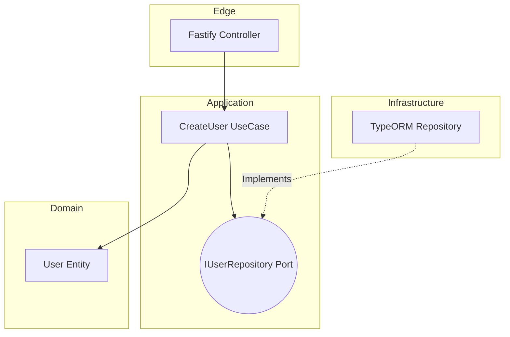

# 🧅 Strict Onion Architecture

## 💡 1. What It Is & Architectural Purpose
Ferrox-Node enforces a strict interpretation of the **Onion Architecture** (also known as Clean Architecture or Hexagonal Architecture). Its architectural purpose is to ensure that core business logic (Domain & Use Cases) remains entirely decoupled from infrastructure constraints, HTTP transport layers, and databases.

In traditional Node.js applications, SQL queries and HTTP Request parsing are often tightly coupled inside Express controllers. This makes the application fragile. Ferrox-Node reverses this dependency flow, making the core domain the center of the universe.

---

## ⚙️ 2. Comprehensive Taxonomy & Key Layers

| Layer | Responsibility | Allowed Dependencies |
| :--- | :--- | :--- |
| **1. Domain Entities (Core)** | Pure TypeScript classes representing business state and invariants. | None. Pure TypeScript only. |
| **2. Use Cases (Application)** | Orchestrates Domain Entities. Implements business rules. | Domain Entities, Port Interfaces. |
| **3. Controllers (Edge)** | Translates HTTP/Kafka payloads into Use Case commands. | Use Cases, DTOs. |
| **4. Infrastructure Adapters**| Concrete implementations (e.g. TypeORM, AWS SDK). | Implements Port Interfaces. |

---

## 🔬 3. How It Works Under the Hood

Dependencies in Ferrox-Node must **only point inward**. 



Because `CreateUser UseCase` only depends on the `IUserRepository` interface, you can swap PostgreSQL for MongoDB simply by providing a different Adapter, without touching the Use Case logic!

---

## 🧠 4. Why It Was Designed This Way (Rationale)

| Feature | Express MVC Pattern | Ferrox Onion Architecture |
| :--- | :--- | :--- |
| **Testability** | Hard. Requires mocking the entire HTTP server and DB. | Easy. Use Cases can be unit-tested with in-memory adapters. |
| **Vendor Lock-in**| High. Tightly coupled to Express and Mongoose. | Zero. The framework is just a delivery mechanism. |

---

## 🚀 5. Usage Guide & Code Examples

### Dependency Inversion in Action

```typescript
// 1. Core Port (Interface)
export interface IUserRepository {
  save(user: User): Promise<void>;
}

// 2. Application Use Case
@Injectable()
export class CreateUserUseCase {
  constructor(
    @Inject('IUserRepository') private readonly repo: IUserRepository
  ) {}

  async execute(command: CreateUserCommand) {
    const user = new User(command.email);
    await this.repo.save(user); // Doesn't know IF it's SQL or Mongo!
    return user;
  }
}

// 3. Infrastructure Adapter
@Injectable()
export class PostgresUserRepository implements IUserRepository {
  async save(user: User): Promise<void> {
    await this.orm.insert(user);
  }
}
```

---

## ⚠️ 6. Anti-Patterns: How NOT to Use It

> [!CAUTION]
> **Anti-Pattern 1: Leaking HTTP context into the Domain**
> Never pass `req` or `res` objects into a Use Case. Extract the necessary variables in the Controller and pass a plain DTO to the Use Case.

> [!WARNING]
> **Anti-Pattern 2: Database Entities in the Domain**
> Do not use TypeORM `@Entity()` or Prisma types as your Domain Entities. Map your DB models to pure Domain classes at the Infrastructure boundary.

---

## 开启 7. Pro-Tips & Best Practices

> [!TIP]
> **Pro-Tip: Folders by Feature**
> Instead of grouping files by type (`/controllers`, `/services`), group them by domain feature (`/users`, `/orders`). Inside each feature folder, replicate the Onion layers (`/users/domain`, `/users/application`, `/users/infrastructure`).
