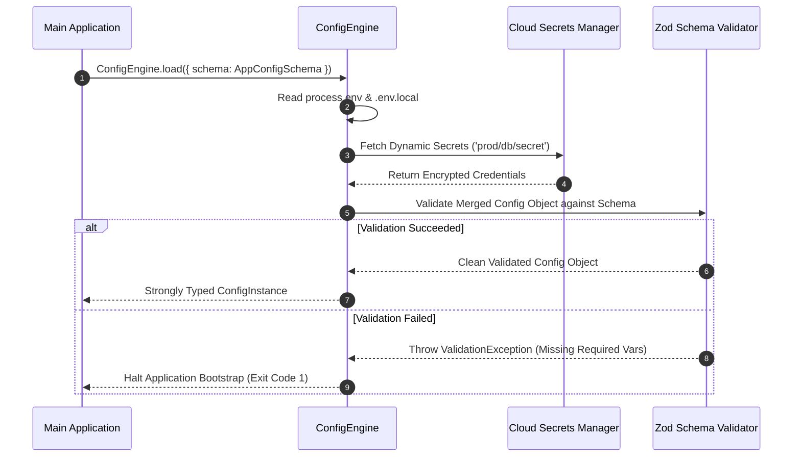

# Dynamic Configuration Engine & Validation Schemas

The `@ferrox/node` config module provides environment variable parsing, YAML / JSON configuration file loading, runtime schema validation (via Zod / Joi), secrets manager integration (AWS Secrets Manager / Vault), and hot-reloading settings managers.

---

## 1. What It Is & Architectural Purpose

Managing application configuration across multiple environments (`development`, `staging`, `production`, `k8s`) can lead to runtime crashes when required environment variables are missing or misconfigured (e.g., passing string `"3000"` to a port variable that expects a number).

The `ConfigEngine` in Ferrox Node guarantees environment configuration integrity. It loads environment variables, validates them against strict Zod/Joi schemas on application startup, and provides strongly typed accessors across the microservice codebase.

```
┌────────────────────────────────────────────────────────────────────────┐
│                         Ferrox ConfigEngine                            │
├────────────────────────────────────────────────────────────────────────┤
│  1. Load Environment Files (.env, .env.local, app.config.yaml)         │
│  2. Fetch Dynamic Secrets (AWS Secrets Manager / HashiCorp Vault)      │
│  3. Validate against Zod / Joi Schema (Fail-Fast on Missing Env)       │
└──────────────────────────────────┬─────────────────────────────────────┘
                                   │ Strongly Typed AppConfig Object
            ┌──────────────────────┼──────────────────────┐
            ▼                      ▼                      ▼
┌──────────────────────┐┌──────────────────────┐┌──────────────────────┐
│ Database Module      ││ Kafka Producer Pool  ││ Redis Cache Cluster  │
└──────────────────────┘└──────────────────────┘└──────────────────────┘
```

---

## 2. What It Does & Key Capabilities

- **Fail-Fast Startup Validation**: Halts application bootstrap immediately with descriptive error logs if required variables are missing or malformed.
- **Multi-Source Layering**: Merges environment variables (`process.env`), local `.env` files, YAML configuration files, and remote Cloud Secrets Managers.
- **Strongly Typed Accessors**: Provides `config.get('database.port')` with full TypeScript type inferencing.
- **Sensitive Key Redaction**: Prevents sensitive keys (passwords, JWT secrets, API tokens) from leaking in log files or debug outputs.

---

## 3. How It Works Under the Hood

### Configuration Loading & Validation Sequence



---

## 4. Why It Was Designed This Way

| Feature | Raw process.env Access | Ferrox ConfigEngine |
| :--- | :--- | :--- |
| **Type Safety** | Everything is `string | undefined`. Requires manual `parseInt()`. | Fully typed integers, booleans, and arrays parsed automatically. |
| **Fail Fast** | App crashes 2 hours into runtime when missing API key is hit. | App fails immediately during startup before serving requests. |
| **Secrets** | Hardcoded secrets in `.env` committed to git. | Dynamic resolution from AWS Secrets Manager or HashiCorp Vault. |

---

## 5. Practical Usage Guide & Extended Code Examples

### 5.1 Defining a Zod Configuration Schema

```typescript
import { z } from 'zod';
import { ConfigEngine } from '@ferrox/node';

export const AppConfigSchema = z.object({
  NODE_ENV: z.enum(['development', 'staging', 'production', 'test']).default('development'),
  PORT: z.coerce.number().default(3000),
  DATABASE_URL: z.string().url(),
  REDIS_HOST: z.string().default('localhost'),
  REDIS_PORT: z.coerce.number().default(6379),
  JWT_SECRET: z.string().min(32),
});

export type AppConfig = z.infer<typeof AppConfigSchema>;

export function loadApplicationConfig(): AppConfig {
  return ConfigEngine.load({
    schema: AppConfigSchema,
    envFilePath: ['.env.local', '.env'],
  });
}
```

---

## 6. Anti-Patterns: How NOT to Use It

> [!CAUTION]
> **Anti-Pattern 1: Directly Reading `process.env` in Domain Services**
> Avoid reading `process.env.MY_VAR` directly inside business services. Always inject the validated `AppConfig` instance to ensure type safety and centralized default handling.

---

## 7. Pro-Tips & Best Practices

> [!TIP]
> **Pro-Tip 1: Dynamic Secret Refresh**
> Use `ConfigEngine.registerRefreshHook()` to periodically refresh DB passwords from AWS Secrets Manager without requiring application pod restarts.
