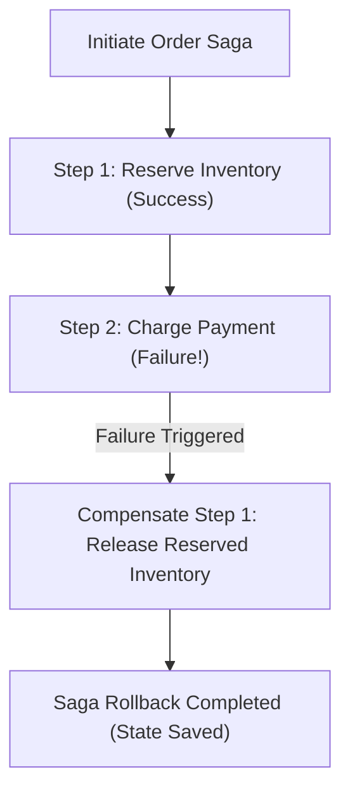

# 🔄 CQRS & Saga Engine (`CqrsSagaEngine`)

## 💡 1. What It Is & Architectural Purpose
`CqrsSagaEngine` is the native Command-Query Responsibility Segregation (CQRS) and Saga orchestration engine built into `@ferrox-node/core`. Its architectural purpose is to decouple read and write execution models in high-throughput applications and orchestrate complex, multi-step distributed transactions across microservices using compensating actions (Saga Pattern).

> [!NOTE]
> In microservice architectures, traditional ACID database transactions across multiple databases lead to tight coupling and poor availability. `CqrsSagaEngine` implements eventually consistent distributed Sagas with automated compensating rollbacks.

---

## ⚙️ 2. What It Does & Key Features

- **Command Bus (`CommandBus`)**: Dispatches state-mutating commands to single-purpose command handlers.
- **Query Bus (`QueryBus`)**: Dispatches non-mutating data queries to specialized query handlers optimized for read views.
- **Saga Orchestrator (`SagaOrchestrator`)**: Manages multi-step workflow states, executing compensation steps (rollback actions) if any step fails.
- **Event-Sourced Event Streams**: Emits strongly-typed `DomainEvent` instances for audit logging and asynchronous event propagation.

---

## 🔬 3. How It Works Under the Hood

### Saga Distributed Transaction Lifecycle



1. **Saga Step Execution**: The orchestrator executes steps sequentially (`Step 1`, `Step 2`, `Step 3`).
2. **Compensation Stack**: For every completed step, a compensating action (e.g. `ReleaseInventory` for `ReserveInventory`) is pushed onto a LIFO execution stack.
3. **Automated Rollback**: If a step fails, the orchestrator pops and executes compensating actions in reverse order to return the system to a consistent state.

---

## 🧠 4. Why It Was Designed This Way (Rationale vs Monolithic Transactions)

| Dimension | 🔄 `CqrsSagaEngine` | 🏛️ Monolithic 2PC (Two-Phase Commit) |
|---|---|---|
| **System Availability** | **High (Eventually Consistent)** | Low (Blocking Lock Invocations) |
| **Scalability** | **Scales Read & Write Paths Independently** | Database Bottleneck on Shared Locks |
| **Fault Tolerance** | **Automated LIFO Compensating Rollbacks** | Cascading Distributed Failures |

---

## 🚀 5. Practical Usage Guide & Extended Code Examples

### Command, Query & Saga Implementation Example

```typescript
import { CqrsSagaEngine, Command, Query, CommandHandler, QueryHandler } from '@ferrox-node/core';

// 1. Define Command & Query DTOs
export class CreateOrderCommand implements Command<string> {
  constructor(public readonly customerId: string, public readonly amount: number) {}
}

export class GetOrderByIdQuery implements Query<any> {
  constructor(public readonly orderId: string) {}
}

// 2. Define Handlers
@CommandHandler(CreateOrderCommand)
export class CreateOrderHandler {
  async execute(command: CreateOrderCommand): Promise<string> {
    console.log(`[CQRS Write Path] Creating order for customer ${command.customerId}`);
    return `order_${Date.now()}`;
  }
}

@QueryHandler(GetOrderByIdQuery)
export class GetOrderByIdHandler {
  async execute(query: GetOrderByIdQuery): Promise<any> {
    console.log(`[CQRS Read Path] Fetching order view ${query.orderId}`);
    return { orderId: query.orderId, status: 'CONFIRMED' };
  }
}

// 3. Execution Example
async function runCqrsWorkflow() {
  const engine = new CqrsSagaEngine();
  
  engine.registerCommandHandler(CreateOrderCommand, new CreateOrderHandler());
  engine.registerQueryHandler(GetOrderByIdQuery, new GetOrderByIdHandler());

  // Execute Command (Write Path)
  const orderId = await engine.dispatchCommand(new CreateOrderCommand('cust-100', 250.00));
  
  // Execute Query (Read Path)
  const orderView = await engine.dispatchQuery(new GetOrderByIdQuery(orderId));
  console.log('Order Result:', orderView);
}

runCqrsWorkflow().catch(console.error);
```

---

## ⚠️ 6. Anti-Patterns: How NOT to Use It

> [!WARNING]
> **Anti-Pattern 1: Mutating System State inside Query Handlers**
> Query handlers must remain strictly side-effect free. Mutating database state or emitting domain state changes inside a QueryHandler breaks CQRS invariants.

---

## 💡 7. Pro-Tips & Best Practices

> [!TIP]
> **Idempotent Compensating Actions**: Always ensure compensating actions in Sagas (e.g. `RefundPayment`) are idempotent so they can be safely retried if network drops occur during rollback operations.
