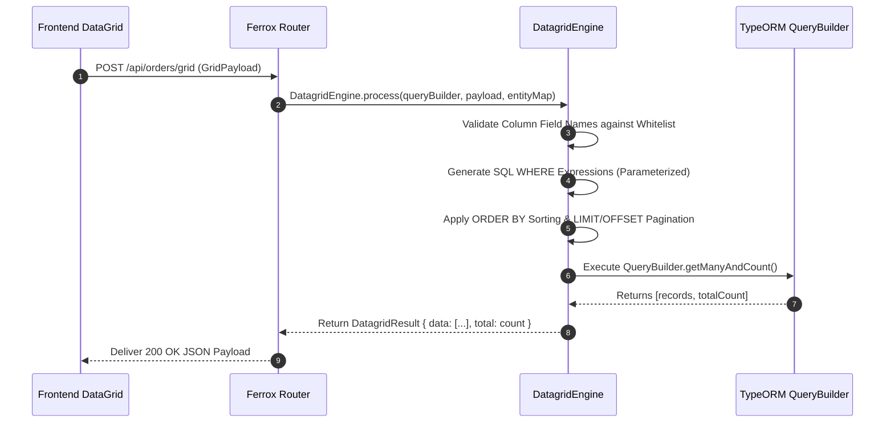

# Data Grid Query Engine & Relational Transformers

The `@ferrox/node` datagrid module provides high-performance server-side data grid handling. It converts generic frontend grid request models (AG-Grid, TanStack Table, Material UI DataGrid) into optimized database execution plans with dynamic filtering, dynamic sorting, pagination offset limits, and JOIN condition resolution.

---

## 1. What It Is & Architectural Purpose

Modern web dashboards require loading tabular data with dynamic multi-column filtering, flexible column sorting, dynamic range search, and server-side pagination. Implementing custom SQL parsing for every table endpoint leads to security risks (SQL injection) and redundant code duplication.

The `DatagridEngine` in Ferrox Node standardizes server-side data grid processing. It acts as an abstraction layer between client-side grid components and ORM query builders (TypeORM / Prisma / Kysely), ensuring 100% type-safe query generation.

```
┌────────────────────────────────────────────────────────────────────────┐
│                        Ferrox DatagridEngine                           │
├────────────────────────────────────────────────────────────────────────┤
│  • Generic Grid Request Parser (AG-Grid / TanStack / MUI)              │
│  • Whitelisted Column Mapping Validator                                │
│  • TypeORM / Kysely QueryBuilder SQL Converter                         │
└──────────────────────────────────┬─────────────────────────────────────┘
                                   │ Parameterized SQL
            ┌──────────────────────┼──────────────────────┐
            ▼                      ▼                      ▼
┌──────────────────────┐┌──────────────────────┐┌──────────────────────┐
│ PostgreSQL Engine    ││ MySQL Engine         ││ SQLite Engine        │
└──────────────────────┘└──────────────────────┘└──────────────────────┘
```

---

## 2. What It Does & Key Capabilities

- **Universal Grid Request Model**: Consumes standard JSON payload specifications containing `page`, `limit`, `sorts`, and `filters`.
- **Parameterized Filter Translation**: Translates text operators (`contains`, `equals`, `startsWith`), numeric range operators (`greaterThan`, `lessThan`, `inRange`), and set selections into safe SQL parameters.
- **Relational Field Resolution**: Automatically injects required `LEFT JOIN` alias references when filtering on nested properties (e.g., `user.department.name`).
- **Column Whitelisting Security**: Prevents SQL injection by strictly matching incoming field keys against registered entity mapping schemas.

---

## 3. How It Works Under the Hood

### Datagrid Query Translation Pipeline



---

## 4. Why It Was Designed This Way

| Metric | Hand-Coded SQL Searching | Ferrox DatagridEngine |
| :--- | :--- | :--- |
| **Security** | Concatenating search strings risks SQL injection. | 100% Parameterized queries with column whitelist enforcement. |
| **Developer Speed**| Writing custom search logic takes days per table. | Single controller decorator handles any data table endpoint. |
| **UI Agnostic** | Bound to a specific frontend grid library. | Universal adapter supports AG-Grid, TanStack, and MUI DataGrid. |

---

## 5. Practical Usage Guide & Extended Code Examples

### 5.1 Controller & Service Datagrid Pipeline

```typescript
import { DatagridEngine, IDatagridRequest } from '@ferrox/node';
import { Repository } from 'typeorm';
import { OrderEntity } from './order.entity';

export async function getOrdersGrid(
  orderRepository: Repository<OrderEntity>,
  gridRequest: IDatagridRequest,
) {
  const queryBuilder = orderRepository.createQueryBuilder('order');

  const datagrid = new DatagridEngine(queryBuilder, gridRequest, {
    id: 'order.id',
    orderNumber: 'order.orderNumber',
    totalAmount: 'order.totalAmount',
    status: 'order.status',
    createdAt: 'order.createdAt',
    'customer.email': 'customer.email',
  });

  // Automatically applies LEFT JOIN if customer.email is filtered
  datagrid.addRelation('order.customer', 'customer');

  const [data, total] = await datagrid.execute();

  return {
    data,
    total,
    page: gridRequest.page || 1,
    limit: gridRequest.limit || 20,
  };
}
```

---

## 6. Anti-Patterns: How NOT to Use It

> [!CAUTION]
> **Anti-Pattern 1: Un-whitelisted Dynamic Column Strings**
> Never pass client-provided string variables directly into `.orderBy()` without validating them through `DatagridEngine` whitelist schemas.

---

## 7. Pro-Tips & Best Practices

> [!TIP]
> **Pro-Tip 1: Indexed Sorting Columns**
> Always ensure database columns used in multi-column sorting rules have appropriate database indexes created to prevent slow sorting scans.
