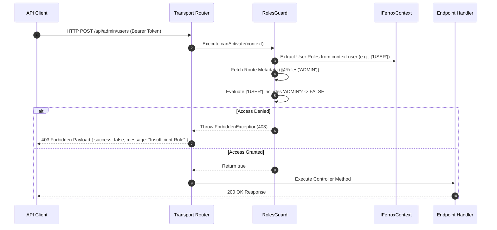

# Security Guards, RBAC & Role Permission Engine

The `@ferrox/node` guards module provides role-based access control (RBAC), attribute-based access control (ABAC), tenant isolation enforcement, and permission verification middleware for Node.js microservices.

---

## 1. What It Is & Architectural Purpose

Securing API routes against unauthorized access is a core requirement for enterprise software. Hardcoding permission checks (`if (user.role !== 'ADMIN')`) inside domain controllers creates code duplication, maintenance friction, and security vulnerabilities when developers forget to include auth checks on new endpoints.

The `guards` module introduces declarative access control decorators (`@UseGuards()`, `@Roles()`, `@Permissions()`, `@TenantIsolated()`). It intercepts incoming requests, parses JWT user tokens, and evaluates role/permission matrix rules before reaching controller execution handlers.

```
┌────────────────────────────────────────────────────────────────────────┐
│                         Ferrox Guard Engine                            │
├────────────────────────────────────────────────────────────────────────┤
│  1. Extract JWT Payload & User Context from IFerroxContext             │
│  2. Evaluate Route Metadata (@Roles('ADMIN'), @Permissions('user:write')│
│  3. Verify Multi-Tenant Context Matches Request Tenant ID              │
└──────────────────────────────────┬─────────────────────────────────────┘
                                   │ Access Evaluation
            ┌──────────────────────┴──────────────────────┐
            ▼                                             ▼
┌─────────────────────────────────┐             ┌────────────────────────┐
│ Granted: Proceed to Controller  │             │ Denied: Return 403     │
│ Execution Pipeline              │             │ Forbidden Response     │
└─────────────────────────────────┘             └────────────────────────┘
```

---

## 2. What It Does & Key Capabilities

- **Declarative Guard Decorators**: Provides `@UseGuards()`, `@Roles()`, `@Permissions()`, and `@TenantIsolated()`.
- **RBAC & ABAC Evaluation Engine**: Checks user roles and dynamic attribute conditions (e.g., `user.department === resource.department`).
- **Multi-Tenant Authorization Guard**: Ensures users from Tenant A cannot access or mutate resources belonging to Tenant B.
- **Hierarchical Role Inheritance**: Supports role hierarchies (e.g., `SUPERADMIN` automatically inherits `ADMIN` and `USER` permissions).

---

## 3. How It Works Under the Hood

### Guard Execution & Permission Check Mechanics



---

## 4. Why It Was Designed This Way

| Feature | Inline Controller Auth Checks | Ferrox Guard Engine |
| :--- | :--- | :--- |
| **Maintainability** | Duplicate `if (user.role)` logic across 100+ controller files. | Single line `@Roles('ADMIN')` decorator per route. |
| **Auditability** | Difficult to verify which routes are secured. | Clean annotation metadata allows automated security route auditing. |
| **Multi-Tenancy** | Risky manual tenant ID matching inside queries. | Automated `@TenantIsolated()` guard verifies tenant isolation. |

---

## 5. Practical Usage Guide & Extended Code Examples

### 5.1 Protecting Endpoints with `@Roles()` and `@Permissions()`

```typescript
import { Controller, Post, Get, Body, UseGuards, Roles, Permissions } from '@ferrox/node';
import { AuthGuard, RolesGuard } from '@ferrox/node/guards';

@Controller('/api/v1/billing')
@UseGuards(AuthGuard, RolesGuard)
export class BillingController {
  @Get('/invoices')
  @Roles('ADMIN', 'FINANCE')
  async listInvoices() {
    return { invoices: [] };
  }

  @Post('/refund')
  @Permissions('billing:refund:write')
  async processRefund(@Body() refundData: any) {
    return { success: true, refundId: 'ref_100' };
  }
}
```

### 5.2 Custom Attribute-Based Access Control (ABAC) Guard

```typescript
import { CanActivate, IFerroxContext } from '@ferrox/node';

export class DepartmentAccessGuard implements CanActivate {
  async canActivate(context: IFerroxContext): Promise<boolean> {
    const user = context.user;
    const requestedDepartment = context.params.department;

    if (!user) return false;

    // Superadmins bypass department checks
    if (user.roles.includes('SUPERADMIN')) return true;

    // Users can only access data belonging to their own department
    return user.department === requestedDepartment;
  }
}
```

---

## 6. Anti-Patterns: How NOT to Use It

> [!CAUTION]
> **Anti-Pattern 1: Silently Catching Guard Exceptions**
> Do not wrap controller methods in try/catch blocks that suppress `ForbiddenException` or `UnauthorizedException` thrown by guards. Let guards handle standard 401/403 HTTP response generation.

---

## 7. Pro-Tips & Best Practices

> [!TIP]
> **Pro-Tip 1: Global Guard Binding**
> Register `AuthGuard` and `RolesGuard` globally in your `YalcApplicationFactory` configuration to ensure every controller endpoint is secure by default unless explicitly annotated with `@Public()`.
