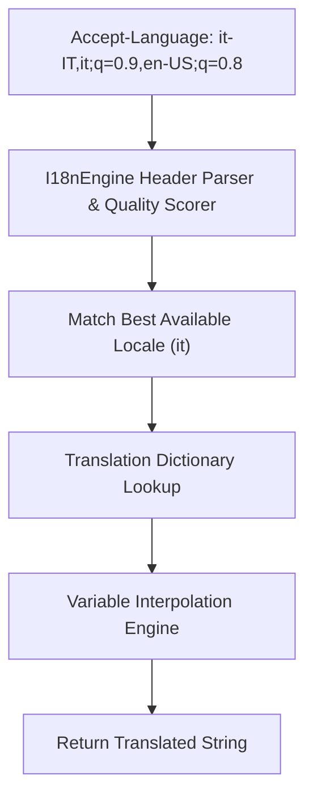

# 🌐 Internationalization Engine (`I18nEngine`)

`I18nEngine` is the native multi-language translation and localization component of `@ferrox-node/core`. It parses inbound HTTP `Accept-Language` headers, resolves localized translation dictionaries, and performs dynamic variable interpolation for global microservices.

---

## 🌟 Key Features

- **`Accept-Language` Header Parser**: Parses and ranks complex HTTP `Accept-Language` header strings (e.g. `it-IT,it;q=0.9,en-US;q=0.8,en;q=0.7`) using quality weight ($q$-factor) algorithms.
- **Dynamic Variable Interpolation**: Replaces template parameters dynamically (e.g. `"Welcome, {{name}}!"` -> `"Benvenuto, Mario!"`).
- **Pluralization & Fallback Locales**: Fallback resolution to default application locales (`en`) if specific translations are missing.
- **JSON / YAML Dictionary Loaders**: Asynchronously loads translation dictionaries from local disk or memory buffers.

---

## 🔬 Internal Architecture & Execution Mechanics



---

## 📊 Architectural Comparison: `I18nEngine` vs Manual Localization

| Feature / Dimension | 🌐 `I18nEngine` | 🐢 Manual String Translation |
|---|---|---|
| **`Accept-Language` $q$-Factor Parsing** | **Automatic Quality Weight Matching** | Manual String Splitting |
| **Fallback Locales** | **Automatic Default Locale Fallback** | Hardcoded Defaults |
| **Performance** | **Pre-Parsed Dictionary Maps in Memory** | Repeated File Reads |

---

## 🚀 Practical Usage & Production Code Examples

### 1. Initializing and Using `I18nEngine`

```typescript
import { I18nEngine } from '@ferrox-node/core';

// Initialize I18n Engine with translation dictionaries
const i18n = new I18nEngine({
  defaultLocale: 'en',
  supportedLocales: ['en', 'it', 'es', 'de'],
  translations: {
    en: {
      user: {
        welcome: 'Welcome back, {{name}}!',
        error_not_found: 'User entity {{id}} was not found.',
      },
    },
    it: {
      user: {
        welcome: 'Bentornato, {{name}}!',
        error_not_found: 'L\'utente con ID {{id}} non è stato trovato.',
      },
    },
  },
});

// Translate using explicit locale or Accept-Language header string
const italianGreeting = i18n.translate('user.welcome', 'it-IT,it;q=0.9', { name: 'Mario' });
console.log(italianGreeting); // "Bentornato, Mario!"

const englishError = i18n.translate('user.error_not_found', 'en', { id: 'usr-100' });
console.log(englishError); // "User entity usr-100 was not found."
```

---

## ⚠️ Common Pitfalls & Anti-Patterns

> [!CAUTION]
> **Hardcoding User-Facing Exception Messages**: Hardcoding plaintext English strings in exception throws prevents clients from receiving localized messages. Use translation key IDs (e.g. `errors.user_not_found`) and translate via `I18nEngine` in response interceptors.

---

## 💡 Best Practices

> [!TIP]
> **Caching Dictionary Lookup Trees**: `I18nEngine` pre-compiles dictionary keys into nested Map structures during startup to ensure sub-microsecond lookup times during HTTP request handling.
