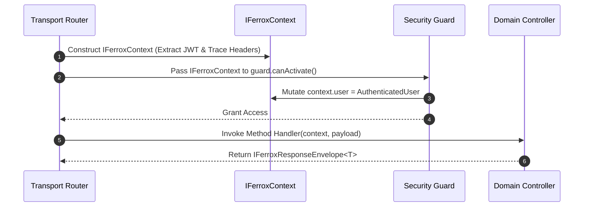

# Core Framework Interfaces & DTO Signatures

The `@ferrox/node` interfaces module exports all standard contract definitions, request lifecycle envelopes, authorization contexts, DTO validation signatures, and resilience options used throughout the Ferrox Node.js microservice architecture.

---

## 1. What It Is & Architectural Purpose

Enterprise Node.js applications rely on standardized interface contracts to maintain loose coupling across core components (authentication guards, CQRS bus handlers, transport adapters, and background job runners). Without centralized type contracts, passing context objects across layers leads to type drift and runtime errors.

The `interfaces` module provides pure TypeScript type definitions that bind all `@ferrox/node` sub-components into a unified, type-safe framework.

```
┌────────────────────────────────────────────────────────────────────────┐
│                        @ferrox/node Interfaces                         │
├────────────────────────────────────────────────────────────────────────┤
│  • IFerroxContext & IFerroxUser                                        │
│  • IFerroxRequestEnvelope<T> & IFerroxResponseEnvelope<T>              │
│  • ICommandBusOptions & IQueryBusOptions                               │
│  • IJobDefinition<TData, TResult>                                      │
└──────────────────────────────────┬─────────────────────────────────────┘
                                   │ Shared Type Contracts
            ┌──────────────────────┼──────────────────────┐
            ▼                      ▼                      ▼
┌──────────────────────┐┌──────────────────────┐┌──────────────────────┐
│ Ferrox Core Kernel   ││ Transports Engine    ││ Security & Auth      │
└──────────────────────┘└──────────────────────┘└──────────────────────┘
```

---

## 2. What It Does & Key Capabilities

- **`IFerroxContext`**: Ambient execution context containing `traceId`, `tenantId`, `user`, and `logger`.
- **`IFerroxResponseEnvelope<T>`**: Standardized HTTP/gRPC response structure (`{ success: boolean, data: T, meta: Record<string, any> }`).
- **`IJobDefinition<TData, TResult>`**: Standardized background job definition for BullMQ / Redis queues.
- **`IHealthCheckResult`**: Standardized payload returned by Ferrox self-test diagnostic runners.

---

## 3. How It Works Under the Hood

### Framework Context Propagation



---

## 4. Why It Was Designed This Way

| Metric | Loose Un-typed Objects | Ferrox Interface Contracts |
| :--- | :--- | :--- |
| **Refactoring Safety** | High risk of breaking property reads (`req.user_id` vs `req.userId`). | IDE auto-completion & instant TS build checks. |
| **Transport Portability**| Code tied directly to Express `Request` object. | Protocol-agnostic `IFerroxContext` works across HTTP, WebSockets, Kafka. |

---

## 5. Practical Usage Guide & Extended Code Examples

### 5.1 Utilizing `IFerroxContext` in Domain Handlers

```typescript
import { IFerroxContext, IFerroxResponseEnvelope } from '@ferrox/node';

export interface UserDTO {
  id: string;
  name: string;
  email: string;
}

export async function getUserProfileHandler(
  ctx: IFerroxContext,
  userId: string,
): Promise<IFerroxResponseEnvelope<UserDTO>> {
  ctx.logger.info(`Fetching user profile for ${userId}`, { traceId: ctx.traceId });

  const user: UserDTO = {
    id: userId,
    name: 'Alice Smith',
    email: 'alice@example.com',
  };

  return {
    success: true,
    data: user,
    meta: {
      timestamp: new Date().toISOString(),
      traceId: ctx.traceId,
    },
  };
}
```

---

## 6. Anti-Patterns: How NOT to Use It

> [!CAUTION]
> **Anti-Pattern 1: Mutating Raw Request Objects directly**
> Do not bypass `IFerroxContext` by attaching arbitrary properties to Express `req` or Fastify `reply`. Always use `ctx.setLocal(key, val)`.

---

## 7. Pro-Tips & Best Practices

> [!TIP]
> **Pro-Tip 1: Strong Generic Typing**
> Always parameterize `IFerroxResponseEnvelope<T>` with your domain DTO to ensure downstream callers receive fully inferred response data shapes.
