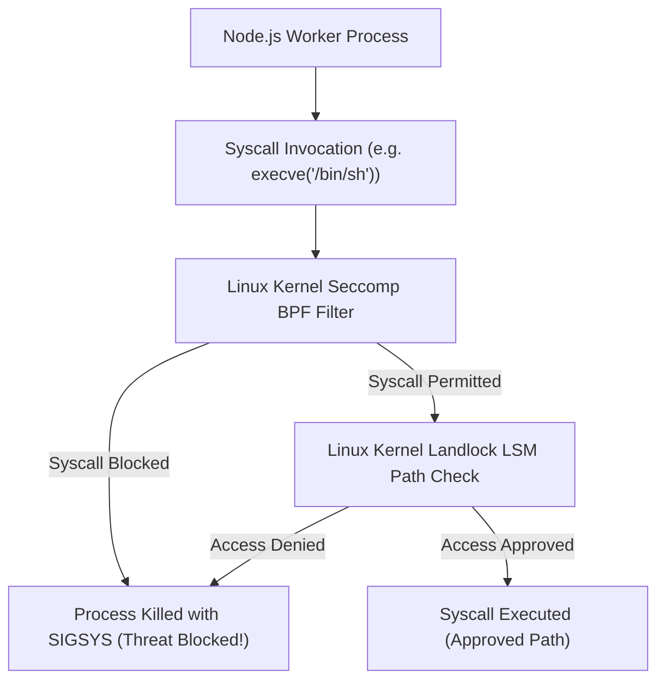

# 🛡️ Linux Kernel Sandboxing (`KernelSandboxService`)

## 💡 1. What It Is & Architectural Purpose
`KernelSandboxService` is the kernel-level process isolation component of `@ferrox-node/core`. Its architectural purpose is to enforce **Zero-Trust process sandboxing** for Node.js worker processes running on Linux hosts, using **Seccomp BPF** (Secure Computing Mode with Berkeley Packet Filters) and **Landlock LSM** (Linux Security Module).

> [!IMPORTANT]
> If an attacker achieves Remote Code Execution (RCE) via a vulnerable NPM dependency, standard Node.js applications allow full access to system calls (`execve`, `ptrace`, `connect`) and host filesystems (`/etc/passwd`, `/root/.ssh`). `KernelSandboxService` restricts Linux kernel capabilities, turning RCE exploits into inert operations.

---

## ⚙️ 2. What It Does & Key Features

- **Seccomp BPF Syscall Filtering**: Restricts allowable Linux system calls (`execve`, `ptrace`, `kexec_load`, `socketcall`) for the Node.js process.
- **Landlock LSM Filesystem Isolation**: Restricts read/write access to approved directory paths (e.g., granting read access only to `/var/app/dist` and write access to `/tmp`).
- **LSASS & Process Telemetry**: Monitors for unauthorized process handle accesses and memory inspection attempts.
- **Dynamic Policy Generation**: Generates Seccomp BPF bytecodes dynamically based on application runtime profile requirements.

---

## 🔬 3. How It Works Under the Hood



---

## 🧠 4. Why It Was Designed This Way (Kernel Sandboxing vs Container Isolation)

| Security Layer | 🛡️ `KernelSandboxService` | 🐳 Docker Container Defaults |
|---|---|---|
| **RCE Protection Level** | **Kernel Enforcement inside the Process** | Root Container Escape Risk |
| **Filesystem Restriction** | **Fine-Grained Landlock Path Sandboxing** | Full Container Root Filesystem Read Access |
| **Syscall Filtering** | **Strict Custom Seccomp BPF Policy** | Generic Docker Seccomp Profile |

---

## 🚀 5. Practical Usage Guide & Extended Code Examples

```typescript
import { KernelSandboxService } from '@ferrox-node/core';

async function applySecuritySandboxing() {
  const kernelService = new KernelSandboxService();

  // 1. Restrict Filesystem Access using Landlock LSM
  kernelService.applyLandlockSandbox({
    readOnlyPaths: ['/var/app/dist', '/usr/lib/node_modules'],
    readWritePaths: ['/tmp/app_logs'],
    blockExecutables: true
  });

  // 2. Apply Seccomp BPF System Call Policy
  kernelService.applySeccompPolicy({
    disallowSyscalls: ['execve', 'ptrace', 'kexec_load', 'sys_rawio'],
    onViolationAction: 'KILL_PROCESS'
  });

  console.log('🛡️ Linux Kernel Seccomp & Landlock LSM Sandboxing Active!');
}

applySecuritySandboxing().catch(console.error);
```

---

## ⚠️ 6. Anti-Patterns: How NOT to Use It

> [!CAUTION]
> **Anti-Pattern 1: Applying Seccomp Syscall Filters Before Loading Native C++ Addons**
> Calling `applySeccompPolicy()` before native Node.js C++ addons (such as `sqlite3` or `bcrypt`) initialize their thread pools can cause process termination if the addon relies on blocked syscalls during initialization.

---

## 💡 7. Pro-Tips & Best Practices

> [!TIP]
> **Production Hardening**: Combine `KernelSandboxService` with `SentinelIntegrationService` to achieve double-layer protection: Sentinel isolates HTTP payload threats while KernelSandbox stops OS system exploits.
