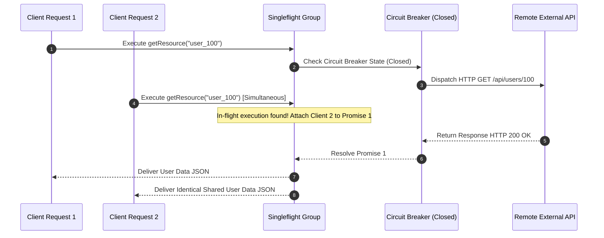

# Circuit Breaker, Singleflight & Resilience Patterns

The `@ferrox/node` resilience component delivers fault-tolerance mechanisms for Node.js microservices: Circuit Breakers (`Closed`, `Open`, `HalfOpen`), Singleflight Request Deduplication, Exponential Backoff Retries, and Rate-Limiting Bouncers.

---

## 1. What It Is & Architectural Purpose

Distributed microservices depend on remote HTTP services, database pools, and external payment gateways. When a downstream dependency experiences latencies or outages, upstream callers can suffer cascading failures: connection pool exhaustion, thread starvation, and thundering herd query bursts.

The `resilience` module implements battle-tested resilience patterns in TypeScript. It isolates failing external dependencies, deduplicates simultaneous identical requests, and handles transient network glitches gracefully.

```
┌────────────────────────────────────────────────────────────────────────┐
│                        Ferrox Resilience Engine                        │
├──────────────────────────────────┬─────────────────────────────────────┤
│  Circuit Breaker State Machine   │  Singleflight Deduplicator          │
│  (Closed -> Open -> HalfOpen)    │  (In-Flight Concurrent Request Join)│
└────────────────┬─────────────────┴──────────────────┬──────────────────┘
                 │ Intercept Failure / Burst
            ┌────┴────────────────────────────────────┴────┐
            ▼                                              ▼
┌─────────────────────────────────┐              ┌───────────────────────┐
│ Fallback Execution Engine       │              │ Shared Promise Return │
│ (Cached Data / Degraded State)  │              │ (Single External Call)│
└─────────────────────────────────┘              └───────────────────────┘
```

---

## 2. What It Does & Key Capabilities

- **Circuit Breaker State Machine**: Switches states between `Closed` (normal), `Open` (failing, rejects calls immediately with fallback), and `HalfOpen` (probing recovery).
- **Singleflight Request Deduplication**: Consolidates multiple concurrent identical request calls into a single underlying execution promise.
- **Exponential Backoff Retries**: Retries transient network failures automatically with configurable jitter algorithm.
- **Fallback Execution Decorators**: Seamlessly returns degraded fallback responses or cached data when downstream services fail.

---

## 3. How It Works Under the Hood

### Singleflight & Circuit Breaker Mechanics



---

## 4. Why It Was Designed This Way

| Feature | Standard Unprotected Calls | Ferrox Resilience Engine |
| :--- | :--- | :--- |
| **Thundering Herd** | 100 concurrent requests trigger 100 identical DB reads. | Singleflight deduplicates 100 requests into 1 single DB query. |
| **Cascading Failure**| Dying payment gateway causes 1000s of HTTP connections to hang. | Circuit Breaker opens after 5 failures and fails fast with fallback. |
| **Recovery** | Manual app restarts required after downstream outage. | `HalfOpen` state probes service recovery automatically. |

---

## 5. Practical Usage Guide & Extended Code Examples

### 5.1 Using Singleflight Group Deduplication

```typescript
import { SingleflightGroup } from '@ferrox/node';

const sfGroup = new SingleflightGroup();

export async function getCachedUserProfile(userId: string) {
  // If 50 requests arrive at the same millisecond for userId "100",
  // fetchUserDataFromDb("100") will execute EXACTLY ONCE.
  return await sfGroup.do(`user_profile_${userId}`, async () => {
    console.log(`Executing expensive database read for ${userId}...`);
    return await fetchUserDataFromDb(userId);
  });
}
```

### 5.2 Configuring Circuit Breaker with Fallback

```typescript
import { CircuitBreaker } from '@ferrox/node';

const breaker = new CircuitBreaker({
  name: 'payment-gateway',
  failureThreshold: 5, // Open circuit after 5 consecutive failures
  resetTimeoutMs: 10000, // Stay Open for 10s before probing HalfOpen
  timeoutMs: 3000, // Timeout requests after 3s
});

export async function processPaymentWithResilience(paymentData: any) {
  return await breaker.execute(
    async () => {
      return await remotePaymentApi.charge(paymentData);
    },
    // Fallback function when Circuit Breaker is OPEN or times out
    async (err) => {
      console.warn(`Payment gateway breaker active (${err.message}). Queueing payment...`);
      return { status: 'QUEUED', trackingId: 'pay_offline_' + Date.now() };
    }
  );
}
```

---

## 6. Anti-Patterns: How NOT to Use It

> [!CAUTION]
> **Anti-Pattern 1: High Reset Timeout without Probing**
> Setting `resetTimeoutMs: 3600000` (1 hour) will keep the circuit breaker in `OPEN` state for an hour even if the downstream service recovers after 10 seconds. Keep reset timeouts tuned between 5s and 30s.

---

## 7. Pro-Tips & Best Practices

> [!TIP]
> **Pro-Tip 1: Combining Singleflight and Circuit Breaker**
> Wrap singleflight execution inside a Circuit Breaker to get both thundering-herd protection and fail-fast resilience for heavy database queries.
