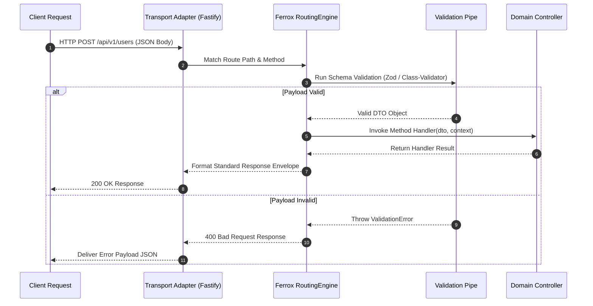

# Multi-Protocol Routing Engine & Dynamic Controllers

The `@ferrox/node` routing component provides an abstraction layer for defining REST endpoints, WebSockets channels, and RPC message handlers. It features automatic route registration, schema validation pipeline injection, rate-limiting parameter binding, and OpenAPI / Swagger spec generation.

---

## 1. What It Is & Architectural Purpose

Enterprise Node.js applications frequently expose API endpoints over multiple transport layers: HTTP REST APIs for public clients, WebSocket channels for real-time notifications, and gRPC / Kafka handlers for internal microservice RPC calls. Duplicate controller definitions across protocols lead to code fragmentation.

The `RoutingEngine` in Ferrox Node abstracts protocol-specific transport layers. Developers write domain handlers using declarative decorators (`@Get()`, `@Post()`, `@MessagePattern()`), and Ferrox registers them across Express, Fastify, WebSocket, or gRPC server adapters automatically.

```
┌────────────────────────────────────────────────────────────────────────┐
│                        Ferrox RoutingEngine                            │
├──────────────────────────────────┬─────────────────────────────────────┤
│  Declarative Decorators          │  Middleware & Validation Pipeline    │
│  (@Get, @Post, @MessagePattern)  │  (Zod / Class-Validator / RateLimit)│
└────────────────┬─────────────────┴──────────────────┬──────────────────┘
                 │ Multi-Protocol Route Dispatch
            ┌────┴─────────────────┬──────────────────┴────┐
            ▼                      ▼                       ▼
┌──────────────────────┐┌──────────────────────┐┌──────────────────────┐
│ Fastify / Express    ││ WebSockets (ws/socket)││ gRPC / Kafka Consumer│
└──────────────────────┘└──────────────────────┘└──────────────────────┘
```

---

## 2. What It Does & Key Capabilities

- **Unified Controller Decorators**: Provide `@Controller()`, `@Get()`, `@Post()`, `@Put()`, `@Delete()`, and `@Patch()` decorators.
- **Protocol Agnostic Parameter Mapping**: Extracts path parameters (`@Param()`), query parameters (`@Query()`), request body (`@Body()`), and context (`@Context()`).
- **Automated Validation Pipe**: Validates incoming payloads using Zod or `class-validator` schemas before reaching controller methods.
- **OpenAPI / Swagger Generation**: Automatically generates OpenAPI v3 JSON spec definitions directly from controller metadata decorators.

---

## 3. How It Works Under the Hood

### Request Routing & Dispatch Mechanics



---

## 4. Why It Was Designed This Way

| Feature | Standard Express Routing | Ferrox RoutingEngine |
| :--- | :--- | :--- |
| **Protocol Parity** | Code bound to `req` and `res` Express APIs. | Handlers receive protocol-agnostic DTO and `IFerroxContext`. |
| **Validation** | Manual validation checks inside every route handler. | Automated validation pipe intercepts before controller execution. |
| **Documentation** | Hand-written Swagger YAML files drift out of date. | Auto-generated OpenAPI spec directly from TS types & decorators. |

---

## 5. Practical Usage Guide & Extended Code Examples

### 5.1 Defining a Declarative Controller

```typescript
import { Controller, Get, Post, Body, Param, Query, UseGuards } from '@ferrox/node';
import { AuthGuard } from '../guards/auth.guard';

export class CreateUserDto {
  email!: string;
  name!: string;
}

@Controller('/api/v1/users')
@UseGuards(AuthGuard)
export class UserController {
  @Get('/')
  async listUsers(@Query('limit') limit: number = 10) {
    return { users: [], limit };
  }

  @Get('/:id')
  async getUserById(@Param('id') id: string) {
    return { id, name: 'John Doe' };
  }

  @Post('/')
  async createUser(@Body() dto: CreateUserDto) {
    return { success: true, user: dto };
  }
}
```

---

## 6. Anti-Patterns: How NOT to Use It

> [!CAUTION]
> **Anti-Pattern 1: Direct Manipulation of Transport Reply Objects**
> Avoid calling `res.send()` or `reply.raw.write()` inside controller methods. Always return plain objects or `IFerroxResponseEnvelope` to preserve multi-protocol transport portability.

---

## 7. Pro-Tips & Best Practices

> [!TIP]
> **Pro-Tip 1: Versioning Prefixing**
> Pass version prefixing to `@Controller('/api/v1/...')` to maintain clean contract versioning when deploying updated microservice endpoints.
