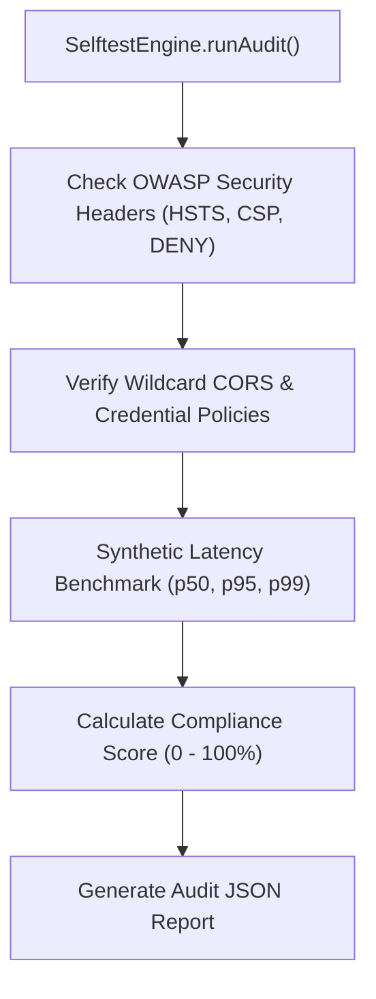

# 🧪 Security Self-Test Auditor (`SelftestEngine`)

`SelftestEngine` is an automated security compliance and performance benchmark auditor built directly into `@ferrox-node/core`. It executes OWASP Web Security Testing Guide (WSTG) compliance checks against application routes before production deployment.

---

## 🌟 Key Features

- **OWASP WSTG Compliance Audit**: Evaluates HTTP response security headers, CORS origin configurations, cookie flags (`HttpOnly`, `Secure`, `SameSite`), and payload size limits.
- **Automated Route Benchmarking**: Measures route latency metrics (p50, p95, p99) under synthetic load to catch performance regressions.
- **Security Report Generation**: Produces JSON and HTML compliance reports detailing security violations and remediation advice.
- **CI/CD Build Gate**: Integrates into deployment pipelines to block deployments if security compliance falls below required thresholds.

---

## 🔬 Internal Architecture & Execution Mechanics



---

## 📊 Architectural Comparison: `SelftestEngine` vs External Scanners

| Feature / Dimension | 🧪 `SelftestEngine` | 🌐 External Vulnerability Scanner |
|---|---|---|
| **Execution Context** | **In-Memory / In-Process Pre-Flight Audit** | External Network Probe |
| **Pipeline Latency** | **Sub-Second Execution (< 500ms)** | Minutes / Hours Scan Time |
| **Framework Awareness** | **Direct Access to Ferrox DI Routes** | Black-Box Crawler Only |

---

## 🚀 Practical Usage & Production Code Examples

```typescript
import { SelftestEngine } from '@ferrox-node/core';

async function executePreDeploymentAudit() {
  const auditor = new SelftestEngine();

  // Run security audit against running local server instance
  const report = await auditor.auditAppRoutes('http://localhost:8080', {
    checkHeaders: true,
    checkCors: true,
    benchmarkLatency: true,
  });

  console.log(`🔒 Security Compliance Score: ${report.complianceScore}%`);
  console.log(`Latency p95: ${report.latencyMetrics.p95}ms`);

  if (report.complianceScore < 100) {
    console.error('❌ Security Violations Found:');
    report.violations.forEach((v) => {
      console.error(` - [${v.severity}] ${v.ruleId}: ${v.description}`);
    });
    process.exit(1); // Block deployment pipeline
  }

  console.log('✅ All security compliance checks passed!');
}

executePreDeploymentAudit().catch(console.error);
```

---

## ⚠️ Common Pitfalls & Anti-Patterns

> [!CAUTION]
> **Running Audits on Staging Database with Destructive Routes**: Ensure synthetic benchmarking is configured to bypass state-mutating endpoints (`DELETE /api/v1/users`) or targets non-production test databases.

---

## 💡 Best Practices

> [!TIP]
> **CI/CD Pipeline Gatekeeper**: Run `SelftestEngine` inside your GitHub Actions or GitLab CI pipeline right after integration tests pass to guarantee 100% OWASP compliance before merging to `main`.
