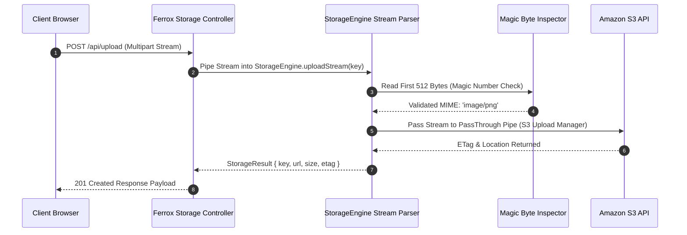

# Cloud Storage, S3 Streams & Presigned URLs

The `@ferrox/node` storage module provides an abstraction layer over cloud object storage providers (Amazon S3, Google Cloud Storage, Azure Blob Storage, and local filesystem). It supports chunked multipart streaming uploads, presigned URL generation, path traversal sanitization, and automated MIME-type validation.

---

## 1. What It Is & Architectural Purpose

Enterprise applications require uploading and retrieving large binary assets (documents, images, videos, data backups) without consuming entire server RAM buffers or introducing security vulnerabilities such as path traversal attacks.

The `StorageEngine` in Ferrox Node provides a unified, protocol-agnostic API for cloud storage. It abstracts vendor SDK complexities while guaranteeing zero-buffer memory streaming and secure presigned URL generation.

```
┌────────────────────────────────────────────────────────────────────────┐
│                         Ferrox StorageEngine                           │
├────────────────────────────────────────────────────────────────────────┤
│  • Path Sanitizer & MIME Inspector                                     │
│  • Multipart Stream Manager (Zero-Buffer RAM Memory)                   │
│  • Presigned URL Signer (S3 / GCS / Azure)                             │
└──────────────────────────────────┬─────────────────────────────────────┘
                                   │ Unified Storage Stream API
            ┌──────────────────────┼──────────────────────┐
            ▼                      ▼                      ▼
┌──────────────────────┐┌──────────────────────┐┌──────────────────────┐
│ Amazon S3 Bucket     ││ Google Cloud Storage ││ Local Filesystem     │
└──────────────────────┘└──────────────────────┘└──────────────────────┘
```

---

## 2. What It Does & Key Capabilities

- **Multipart Streaming Uploads**: Upload multi-gigabyte files using Node.js `Readable` streams with chunked RAM buffering.
- **Presigned Upload & Download URLs**: Generate temporary signed URLs (`s3.getSignedUrlPromise`) for direct client browser uploads.
- **Path Traversal Shield**: Automatically strips `../`, null-byte injections, and path traversal sequences from target keys.
- **MIME-Type & Magic Byte Inspection**: Inspects binary magic numbers to prevent malicious file uploads (e.g., renaming `.exe` to `.png`).

---

## 3. How It Works Under the Hood

### Zero-Buffer Upload Stream Pipeline



---

## 4. Why It Was Designed This Way

| Feature | Direct AWS SDK Calls | Ferrox StorageEngine |
| :--- | :--- | :--- |
| **RAM Usage** | Loading entire file into Node `Buffer` crashes process on 2GB files. | Zero-buffer Node.js `PassThrough` stream pipe. |
| **Vendor Locking**| Code hardcoded to `@aws-sdk/client-s3`. | Single interface works seamlessly across S3, GCS, and Local disk. |
| **Security** | Un-sanitized keys expose file overwrites on disk. | Strict key sanitization & magic byte validation. |

---

## 5. Practical Usage Guide & Extended Code Examples

### 5.1 Uploading Files via Readable Streams

```typescript
import { StorageEngine, StorageProvider } from '@ferrox/node';
import { createReadStream } from 'fs';

const storage = new StorageEngine({
  provider: StorageProvider.S3,
  s3Options: {
    region: 'us-east-1',
    bucket: 'company-documents-bucket',
  },
});

export async function uploadDocument(filePath: string, destinationKey: string) {
  const fileStream = createReadStream(filePath);

  const result = await storage.uploadStream({
    key: `documents/${destinationKey}`,
    stream: fileStream,
    contentType: 'application/pdf',
  });

  console.log(`Document uploaded successfully: ${result.location}`);
}
```

### 5.2 Generating Presigned Download URLs

```typescript
export async function getDownloadLink(key: string): Promise<string> {
  // Generates presigned URL valid for 15 minutes (900 seconds)
  const presignedUrl = await storage.getSignedDownloadUrl({
    key,
    expiresInSeconds: 900,
  });

  return presignedUrl;
}
```

---

## 6. Anti-Patterns: How NOT to Use It

> [!CAUTION]
> **Anti-Pattern 1: Buffering Uploads into Memory**
> Avoid `fs.readFileSync()` or reading file bodies into `Buffer.from()` before passing to storage. Always pass `Readable` streams.

---

## 7. Pro-Tips & Best Practices

> [!TIP]
> **Pro-Tip 1: Presigned Browser Direct Uploads**
> Use `getSignedUploadUrl()` to let frontend web clients upload files directly to S3, bypassing backend API servers entirely.
