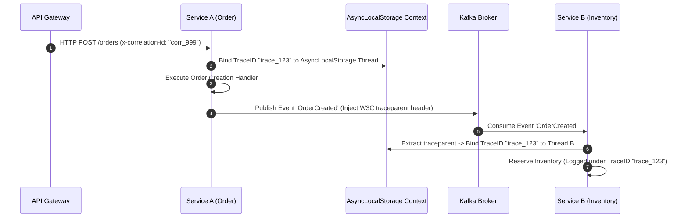

# OpenTelemetry Distributed Tracing & Correlation Identifiers

The `@ferrox/node` tracing component delivers zero-overhead distributed tracing, OpenTelemetry (OTel) instrumentation, correlation ID propagation across HTTP/gRPC/Kafka boundaries, and Node.js `AsyncLocalStorage` context retention.

---

## 1. What It Is & Architectural Purpose

In a distributed microservice ecosystem, a single user click can trigger a chain of multi-service HTTP requests, database queries, and asynchronous Kafka events. When an error occurs or latencies spike, diagnosing the root cause across log files requires distributed trace correlation.

The `tracing` module automatically creates OpenTelemetry trace spans, injects correlation identifiers into HTTP request headers (`x-correlation-id`) and Kafka event headers, and binds trace state to Node.js `AsyncLocalStorage` so loggers automatically log the current trace ID without manual parameter passing.

```
┌────────────────────────────────────────────────────────────────────────┐
│                        Ferrox Tracing Pipeline                         │
├────────────────────────────────────────────────────────────────────────┤
│  • W3C TraceContext & B3 Header Extractor                              │
│  • AsyncLocalStorage Trace Context Manager                             │
│  • OpenTelemetry Exporter (Jaeger / Zipkin / OTLP gRPC)               │
└──────────────────────────────────┬─────────────────────────────────────┘
                                   │ Context Propagation
            ┌──────────────────────┼──────────────────────┐
            ▼                      ▼                      ▼
┌──────────────────────┐┌──────────────────────┐┌──────────────────────┐
│ HTTP API Requests    ││ TypeORM SQL Queries  ││ Kafka Event Streams  │
└──────────────────────┘└──────────────────────┘└──────────────────────┘
```

---

## 2. What It Does & Key Capabilities

- **Automatic Header Injection/Extraction**: Reads/writes W3C `traceparent` and `x-correlation-id` headers seamlessly across microservices.
- **AsyncLocalStorage Context Retention**: Preserves current trace span context across async execution threads without prop-drilling.
- **TypeORM & Redis Span Instrumentation**: Automatically records SQL execution time and Redis cache query spans.
- **OTLP Exporter Integration**: Ships spans to OpenTelemetry collectors, Grafana Tempo, Jaeger, and Datadog via OTLP gRPC/HTTP.

---

## 3. How It Works Under the Hood

### Distributed Trace Context Propagation



---

## 4. Why It Was Designed This Way

| Feature | Manual Trace Parameter Passing | Ferrox Distributed Tracing |
| :--- | :--- | :--- |
| **Developer Ergonomics**| Manual `(traceId, span)` passed to every function call. | Zero prop-drilling. Loggers automatically read `AsyncLocalStorage`. |
| **Cross-Protocol** | Correlation breaks when jumping from HTTP to Kafka. | Automatic header injection across REST, GraphQL, Kafka, and gRPC. |
| **Performance** | High allocation overheads. | Sampling rates (e.g., 10% sampling) prevent log collector floods. |

---

## 5. Practical Usage Guide & Extended Code Examples

### 5.1 Initializing Tracing Module in Microservices

```typescript
import { TracingEngine } from '@ferrox/node';

const tracing = new TracingEngine({
  serviceName: 'payment-service',
  exporterUrl: process.env.OTEL_EXPORTER_OTLP_ENDPOINT || 'http://localhost:4317',
  samplingRatio: 0.1, // Sample 10% of production transactions
});

tracing.start();
```

### 5.2 Creating Manual Custom Spans

```typescript
import { TracingEngine } from '@ferrox/node';

export async function processPayment(paymentId: string, amount: number) {
  return await TracingEngine.trace('processPaymentTask', async (span) => {
    span.setAttribute('paymentId', paymentId);
    span.setAttribute('amount', amount);

    // Perform heavy payment processing logic
    const result = await executePaymentGatewayCall(paymentId, amount);

    span.setAttribute('status', result.status);
    return result;
  });
}
```

---

## 6. Anti-Patterns: How NOT to Use It

> [!CAUTION]
> **Anti-Pattern 1: Disabling AsyncLocalStorage**
> Avoid manually extracting trace ID headers in controllers and storing them in global variables. Node.js event-loop concurrency will cause trace IDs to bleed between requests.

---

## 7. Pro-Tips & Best Practices

> [!TIP]
> **Pro-Tip 1: Automatic Pino Logger Integration**
> Pair Ferrox Tracing with Ferrox Logger so every JSON log output automatically includes `"traceId": "..."` and `"spanId": "..."`.
