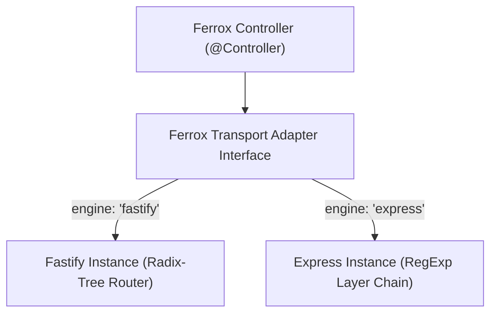

# ⚡ Dual Engine Transports (`FastifyAdapter` & `ExpressAdapter`)

## 💡 1. What It Is & Architectural Purpose
The **Dual Engine Transports** represent the native HTTP abstraction architecture of Ferrox-Node. They empower developers to swap the underlying HTTP engine between **Fastify** (for extreme throughput, HTTP/2, and JSON Schema validation) and **Express** (for compatibility with legacy middleware ecosystems), **without altering a single line of business code in Controllers or Services**.

---

## ⚙️ 2. What It Does & Key Features
- **Fastify Engine (`FastifyAdapter`)**: High throughput (up to 75,000 req/sec on Node.js), native JSON Schema validation, and HTTP/2 support.
- **Express Engine (`ExpressAdapter`)**: Maximum ecosystem compatibility to reuse traditional Node.js middleware (`cors`, `morgan`, `multer`).
- **Unified Request/Response Context**: Ferrox-Node controllers consume a normalized interface abstracting differences between Fastify Request/Reply and Express Request/Response objects.

---

## 🔬 3. How It Works Under the Hood



1. **Routing Adapter Pattern**: Upon bootstrap (`new FerroxApp({ engine })`), Ferrox-Node maps `@Get` and `@Post` route decorators to Fastify's Radix-Tree router or Express's RegExp layer chain.
2. **Normalized Lifecycle**: Lifecycle hooks (`onAppStart`, `onAppDestroy`) and security guards are registered seamlessly in the chosen engine's native stack.

---

## 🧠 4. Why It Was Designed This Way (Swappable Dual Engine)

| Feature | ⚡ Fastify Engine (`fastify`) | 🚂 Express Engine (`express`) |
|---|---|---|
| **Routing Algorithm** | **Radix-Tree (O(1) Path Lookup)** | Linear Array / RegExp Matching |
| **Throughput (Req/sec)** | **~75,000 req/sec** | ~28,000 req/sec |
| **JSON Serialization** | **`fast-json-stringify` (Super Fast)** | `JSON.stringify` (Standard V8) |
| **Middleware Compatibility** | Native Fastify Plugins | Thousands of Legacy NPM Middleware |

---

## 🚀 5. Practical Usage Guide & Extended Code Examples

### Swapping HTTP Engines during Bootstrap

```typescript
import { FerroxApp, FerroxDIContainer } from '@ferrox-node/core';
import { ApiController } from './controllers/api.controller';

async function bootstrap() {
  const di = FerroxDIContainer.getInstance();
  
  // Dynamic HTTP engine selection via environment variable
  const selectedEngine = (process.env.HTTP_ENGINE as 'fastify' | 'express') || 'fastify';

  const app = new FerroxApp({
    engine: selectedEngine, // 'fastify' or 'express'
    port: 8080,
    controllers: [ApiController],
  });

  await app.start();
  console.log(`⚡ Ferrox-Node running on port 8080 using [${selectedEngine.toUpperCase()}] engine`);
}

bootstrap().catch(console.error);
```

---

## ⚠️ 6. Anti-Patterns: How NOT to Use It

1. ❌ **DO NOT access Express-native Request methods directly when using Fastify**: Using Express-specific methods (`req.get()`) breaks transport abstraction if the application is booted on Fastify (`req.headers[...]`).
2. ❌ **DO NOT use incompatible Fastify plugins if you plan to switch to Express**: Keep middleware definitions at the Ferrox-Node abstraction level (`middlewares: [...]`).

---

## 💡 7. Pro-Tips & Best Practices

> [!TIP]
> **Production vs Development**: Use `fastify` in production to reduce p99 latency by 60% and lower Node.js server CPU consumption.
