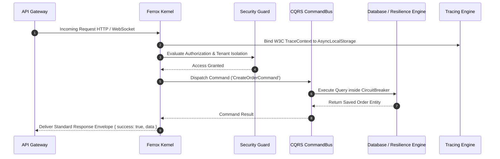

# Introduction & Ferrox-Node Framework Architecture

Welcome to **Ferrox-Node** (`@ferrox/node`), the high-performance enterprise Node.js framework designed for building ultra-resilient, event-driven microservices, multi-protocol API gateways, and distributed cloud applications.

---

## 1. What It Is & Architectural Purpose

Building production-ready microservices in Node.js requires integrating dozens of disconnected libraries: web frameworks (Fastify/Express), ORMs (TypeORM/Prisma), loggers (Pino), resilience tools (Circuit Breakers), tracing SDKs (OpenTelemetry), and job queues (BullMQ).

**Ferrox-Node** unifies these components into a single, cohesive microservice kernel. It eliminates glue code, enforces strict security boundaries, and provides production-grade operational features out of the box.

```
┌────────────────────────────────────────────────────────────────────────────────────────┐
│                                 YOUR FERROX MICROSERVICE                               │
├────────────────────────────────────────────────────────────────────────────────────────┤
│  Routing Engine  │  CQRS Bus  │  Resilience Engine  │  Datagrid  │  Storage  │  Auth Guard │
├──────────────────┴───────────┴────────────────────┴────────────┴───────────┴────────────┤
│                                 FERROX-NODE CORE KERNEL                                │
├────────────────────────────────────────────────────────────────────────────────────────┤
│  Pino Logger  │  AsyncLocalStorage Tracing  │  Zod Config  │  Self-Test Diagnostics    │
└────────────────────────────────────────────────────────────────────────────────────────┘
```

---

## 2. Core Architectural Components

| Component | Category & Domain | Key Feature |
| :--- | :--- | :--- |
| **`auth`** | Security & Identity | Multi-strategy authentication (JWT, OAuth2, API Keys). |
| **`config`** | Dynamic Settings | Zod schema environment validation & secrets manager caching. |
| **`core`** | Framework Kernel | Application lifecycle bootstrap & dependency injection. |
| **`cqrs`** | Pattern Architecture | Command Bus, Query Bus, and Event Sourcing dispatchers. |
| **`datagrid`** | Query Translation | Server-side AG-Grid / TanStack TypeORM query builder. |
| **`guards`** | Authorization | Declarative RBAC / ABAC / Multi-Tenant security guards. |
| **`i18n`** | Internationalization | Multi-language translation & localized string formatting. |
| **`interfaces`**| Core Contracts | Shared type definitions & standard response envelopes. |
| **`jobs`** | Background Queues | Distributed queue processing powered by Redis & BullMQ. |
| **`kernel`** | Microservice Engine | Context propagation & graceful shutdown orchestration. |
| **`resilience`** | Fault Tolerance | Circuit Breaker, Singleflight deduplication & retries. |
| **`routing`** | Multi-Protocol | Declarative REST, WebSocket & RPC route decorators. |
| **`security`** | Edge Protection | Helmet CSP headers, rate limiters, payload bouncers. |
| **`selftest`** | Health Diagnostics | OWASP security compliance runner & latency benchmarks. |
| **`storage`** | Cloud Object Storage | Zero-buffer S3 streams & presigned download URLs. |
| **`tracing`** | Observability | OpenTelemetry distributed tracing & W3C context headers. |
| **`transports`**| Multi-Protocol | Fastify HTTP, Express HTTP & Kafka messaging engines. |

---

## 3. Core Architectural Philosophy

### 1. High Performance & Low Latency
Built around Fastify and Pino, Ferrox-Node avoids synchronous blocking bottlenecks and uses zero-copy memory pipelines wherever possible.

### 2. Built-in Resilience
Every external API call or database query can be wrapped in Circuit Breakers and Singleflight deduplicators to prevent thundering herd crashes.

### 3. Comprehensive Observability
Every log entry, HTTP request, database query, and Kafka event automatically retains trace correlation IDs via Node.js `AsyncLocalStorage`.

---

## 4. Execution Sequence Flow



---

## 5. Next Steps

- Proceed to the [Quickstart Guide](quickstart.md) to bootstrap your first Ferrox-Node service.
- Explore individual component guides in the **Framework Components** sidebar section.
