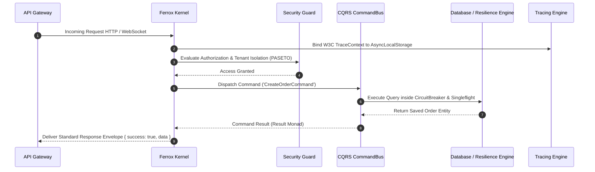

# 🚀 Introduction & Ferrox-Node Architecture

Welcome to **Ferrox-Node** (`@ferrox/node`), the high-performance enterprise Node.js framework designed for building ultra-resilient, event-driven microservices, multi-protocol API gateways, and distributed cloud applications.

While Node.js is traditionally known for lightweight APIs and rapid prototyping, **Ferrox-Node** reimagines it for mission-critical, Tier-1 enterprise environments (e.g., FinTech, E-Commerce ERPs). It ports the strict guarantees, zero-trust security, and resilience patterns from the Ferrox Rust ecosystem directly into the V8 Engine.

---

## 1. What It Is & Architectural Purpose

Building production-ready microservices in Node.js requires integrating dozens of disconnected libraries: web frameworks (Fastify/Express), ORMs (TypeORM/Prisma), loggers (Pino), resilience tools (Circuit Breakers), tracing SDKs (OpenTelemetry), and job queues (BullMQ).

**Ferrox-Node** unifies these components into a single, cohesive microservice kernel. It eliminates glue code, enforces strict security boundaries, and provides production-grade operational features out of the box.

```
┌────────────────────────────────────────────────────────────────────────────────────────┐
│                                 YOUR FERROX MICROSERVICE                               │
├────────────────────────────────────────────────────────────────────────────────────────┤
│  Routing Engine  │  CQRS Bus  │  Resilience Engine  │  Datagrid  │  Storage  │  Auth Guard │
├──────────────────┴───────────┴────────────────────┴────────────┴───────────┴────────────┤
│                                 FERROX-NODE CORE KERNEL                                │
├────────────────────────────────────────────────────────────────────────────────────────┤
│  Pino Logger  │  AsyncLocalStorage Tracing  │  Zod Config  │  Self-Test Diagnostics    │
└────────────────────────────────────────────────────────────────────────────────────────┘
```

---

## 2. Core Architectural Philosophy

The core philosophy of Ferrox-Node is **Fail-Safe Execution, Resilience, and Zero-Trust**.
In massive distributed systems, uncaught promise rejections, V8 memory leaks, or third-party API timeouts can cause catastrophic cascading failures (Event Loop blocking). Ferrox-Node eradicates these risks by moving away from traditional Express.js patterns (Fat Controllers, untyped middleware chains) in favor of **CQRS, Circuit Breakers, Dependency Injection, and PASETO Auth**.

### 1. High Performance & Low Latency
Built around Fastify and Pino, Ferrox-Node avoids synchronous blocking bottlenecks and uses zero-copy memory pipelines wherever possible.

### 2. Built-in Resilience (Circuit Breaker & Singleflight)
Building standard Node.js endpoints often leaves the Event Loop vulnerable to cache stampedes (Thundering Herd problem). Ferrox-Node solves this natively.
- **The Singleflight Pattern**: If 10,000 requests hit your endpoint simultaneously asking for the same heavy query, the `Singleflight` deduplicator ensures the database query executes exactly **once**. All 10,000 promises resolve with the same result, saving the database from crashing.
- **The Circuit Breaker Pattern**: Never block the Event Loop waiting for an external ERP. The `CircuitBreaker` wraps these calls: if the ERP times out 3 times in a row, the circuit *opens* and immediately returns an HTTP 503 (Fast-Fail).

### 3. Comprehensive Observability
Every log entry, HTTP request, database query, and Kafka event automatically retains trace correlation IDs via Node.js `AsyncLocalStorage`.

---

## 3. Core Architectural Components

| Component | Category & Domain | Key Feature |
| :--- | :--- | :--- |
| **`auth`** | Security & Identity | Multi-strategy authentication (PASETO v4, OAuth2, API Keys). |
| **`config`** | Dynamic Settings | Zod schema environment validation & secrets manager caching. |
| **`core`** | Framework Kernel | Application lifecycle bootstrap & dependency injection. |
| **`cqrs`** | Pattern Architecture | Command Bus, Query Bus, and Event Sourcing dispatchers. |
| **`datagrid`** | Query Translation | Server-side AG-Grid / TanStack TypeORM query builder. |
| **`guards`** | Authorization | Declarative RBAC / ABAC / Multi-Tenant security guards. |
| **`i18n`** | Internationalization | Multi-language translation & localized string formatting. |
| **`interfaces`**| Core Contracts | Shared type definitions & standard response envelopes. |
| **`jobs`** | Background Queues | Distributed queue processing powered by Redis & BullMQ. |
| **`kernel`** | Microservice Engine | Context propagation & graceful shutdown orchestration. |
| **`resilience`** | Fault Tolerance | Circuit Breaker, Singleflight deduplication & retries. |
| **`routing`** | Multi-Protocol | Declarative REST, WebSocket & RPC route decorators. |
| **`security`** | Edge Protection | Helmet CSP headers, rate limiters, payload bouncers. |
| **`selftest`** | Health Diagnostics | OWASP security compliance runner & latency benchmarks. |
| **`storage`** | Cloud Object Storage | Zero-buffer S3 streams & presigned download URLs. |
| **`tracing`** | Observability | OpenTelemetry distributed tracing & W3C context headers. |
| **`transports`**| Multi-Protocol | Fastify HTTP, Express HTTP & Kafka messaging engines. |

---

## 4. Execution Sequence Flow


```mermaid
sequenceDiagram
    autonumber
    participant Gateway as API Gateway
    participant Kernel as Ferrox Kernel
    participant Guard as Security Guard
    participant Bus as CQRS CommandBus
    participant DB as Database / Resilience Engine
    participant Trace as Tracing Engine

    Gateway->>Kernel: Incoming Request HTTP / WebSocket
    Kernel->>Trace: Bind W3C TraceContext to AsyncLocalStorage
    Kernel->>Guard: Evaluate Authorization & Tenant Isolation (PASETO)
    Guard-->>Kernel: Access Granted
    Kernel->>Bus: Dispatch Command ('CreateOrderCommand')
    Bus->>DB: Execute Query inside CircuitBreaker & Singleflight
    DB-->>Bus: Return Saved Order Entity
    Bus-->>Kernel: Command Result (Result Monad)
    Kernel-->>Gateway: Deliver Standard Response Envelope { success: true, data }
```

---

## 5. ✅ Best Practices vs ❌ Anti-Patterns

- **✅ Use the Dependency Injection (DI) Container**: Never use `new Service()` inside a controller. Always rely on `@Injectable()` and the `FerroxDIContainer`.
- **✅ Fail Fast with Yalc Errors**: Throw strongly-typed exceptions (`InternalServerError`, `UnauthorizedError`). The Global Exception Filter will format them into standard RFC 7807 JSONs.
- **❌ Fat Controllers**: Do not execute business logic or heavy ORM operations directly in the Controller. *Always dispatch to a Service or the CQRS CommandBus.*
- **❌ Sync Blocking**: Never use `fs.readFileSync` or CPU-bound crypto operations without worker threads. Use Ferrox's async utilities to respect the V8 Event Loop.

---

## 6. Next Steps

- Proceed to the [Quickstart Guide](quickstart.md) to bootstrap your first Ferrox-Node service.
- Explore individual architecture guides in the sidebar.
