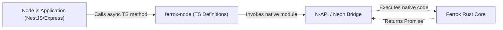

# 🚀 Ferrox Node Overview

## 💡 1. What It Is & Architectural Purpose

**Ferrox Node** is the crucial bridge that connects the high-performance Rust core (`ferrox`) with the Node.js ecosystem (`nestjs-yalc` and `node-yalc`).

While Node.js is excellent for routing, API design, and rapid development (especially with frameworks like NestJS), it is single-threaded and struggles with heavy computational tasks or extremely high-throughput data processing. Rust, on the other hand, excels in these areas but has a steeper learning curve for standard web development.

Ferrox Node gives you the best of both worlds by exposing Rust's performance capabilities directly to Node.js via **N-API (Neon / NAPI-RS)**.

---

## ⚙️ 2. Comprehensive Taxonomy & Key Features

Ferrox Node aligns perfectly with the 7-Layer Architecture by acting as a high-performance substrate for standard Node features:

- **High-Throughput Serialization**: Direct binary data mapping between V8 and Rust memory spaces.
- **Background Task Offloading**: Moving intensive CPU-bound tasks (like cryptographic hashing, complex sorting, or big data parsing) off the Node event loop.
- **Native Kafka Stream Processing**: Consuming and producing Kafka streams natively in Rust, exposing only the relevant events to Node.

---

## 🔬 3. How It Works Under the Hood

Ferrox Node compiles the Rust `ferrox` core into a native Node.js addon (`.node` file). It then provides idiomatic TypeScript wrappers around these native functions.

1. **Rust Core**: The heavy lifting (e.g., complex calculations, Kafka stream processing) is done in Rust.
2. **N-API Bindings**: Rust functions are exposed to C-ABI via N-API.
3. **TypeScript Interface**: `ferrox-node` provides strong TypeScript definitions (`d.ts`) that match the Rust exports.
4. **Node.js Integration**: Your NestJS application imports `ferrox-node` just like any standard npm package.



---

## 🧠 4. Why It Was Designed This Way (Rationale)

When crossing the boundary between V8 (JavaScript engine) and Rust, there is a small serialization/deserialization overhead. `ferrox-node` is architected to mitigate this by:
- Passing pointers or Buffers instead of full JSON objects where possible.
- Using asynchronous Rust functions that return Promises to Node.js, ensuring the main Event Loop is never blocked during heavy processing.

---

## 🚀 5. Practical Usage Guide & Extended Code Examples

To use Ferrox Node within a NestJS-YALC application, simply inject it or instantiate the wrapper:

```typescript
import { Injectable } from '@nestjs/common';
import { FerroxEngine } from 'ferrox-node';

@Injectable()
export class HighPerformanceService {
  private engine: FerroxEngine;

  constructor() {
    this.engine = new FerroxEngine();
  }

  async processMassiveData(dataId: string) {
    // This call executes natively in Rust, freeing the Node event loop
    const result = await this.engine.computeComplexModels(dataId);
    return result;
  }
}
```

---

## ⚠️ 6. Anti-Patterns: How NOT to Use It

> [!CAUTION]
> **Anti-Pattern 1: Frequent Boundary Crossing**
> Do not call a native Rust function in a tight loop from Node.js (e.g., iterating a million items in JS and calling Rust for each). The N-API boundary overhead will destroy the performance gains. Instead, pass the entire array/buffer to Rust and do the loop there.

---

## 💡 7. Pro-Tips & Best Practices

> [!TIP]
> **Pro-Tip 1: Use Buffers for Large Data**
> When passing binary data like images, files, or raw packets, use Node.js `Buffer` objects instead of encoding to Base64 strings. `ferrox-node` maps Node buffers to Rust `&[u8]` directly with zero copy.

---

## 🔗 Cross-References

- [NestJS-YALC Integration](../nestjs-yalc/overview.md)
- [Node-YALC Foundations](../node-yalc/overview.md)
