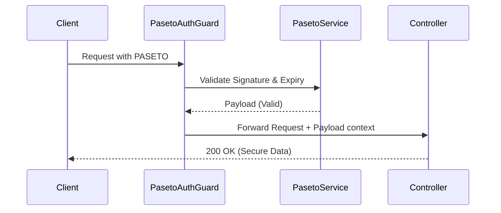

# 🛡️ PASETO Token Authentication (`@ferrox-node/security`)

## 💡 1. What It Is & Architectural Purpose
The `PasetoAuthGuard` and associated utilities provide an implementation of **PASETO (Platform-Agnostic Security Tokens)** for Ferrox-Node. Unlike JWTs, which give developers too many cryptographic algorithms to choose from (often leading to vulnerabilities like the "none" algorithm attack), PASETO is secure by default. Its architectural purpose is to provide an uncompromisable, developer-proof token standard for authenticating API requests.

---

## ⚙️ 2. Comprehensive Taxonomy & Key Features

| Component | Description | Use Case |
| :--- | :--- | :--- |
| **`PasetoService`** | Core service for generating and validating v4.public and v4.local tokens. | Minting tokens upon user login. |
| **`PasetoAuthGuard`** | Middleware interceptor for controllers. | Protecting routes from unauthenticated access. |
| **`@CurrentUser()`** | Parameter decorator for controllers. | Extracting the validated token payload in route handlers. |

---

## 🔬 3. How It Works Under the Hood

The `PasetoAuthGuard` intercepts the incoming HTTP request, extracts the `Authorization: Bearer v4.public...` header, and validates the cryptographic signature using the `PasetoService`. 



The underlying cryptography uses Ed25519 for public tokens (asymmetric) and XChaCha20-Poly1305 for local tokens (symmetric).

---

## 🧠 4. Why It Was Designed This Way (Rationale)

### PASETO vs JWT

| Feature | PASETO (v4) | JWT |
| :--- | :--- | :--- |
| **Algorithm Agility** | **Fixed & Secure** | High (Prone to misconfiguration) |
| **Symmetric Encryption**| **XChaCha20-Poly1305** | AES-GCM (Vulnerable to nonce reuse) |
| **Header Manipulation** | **Impossible** | Vulnerable to 'alg: none' attacks |

We chose PASETO over JWT for `@ferrox-node/security` because it eliminates entire classes of vulnerabilities that plague JWT implementations, aligning with Ferrox's "Secure by Default" philosophy.

---

## 🚀 5. Usage Guide & Code Examples

### Protecting a Controller with PASETO

```typescript
import { Controller, Get, UseGuards } from '@ferrox-node/core';
import { PasetoAuthGuard, CurrentUser, PasetoPayload } from '@ferrox-node/security';

@Controller('/api/v1/users')
export class UsersController {
  
  @Get('/me')
  @UseGuards(PasetoAuthGuard)
  getProfile(@CurrentUser() user: PasetoPayload) {
    return {
      message: 'Secure Data Accessed',
      userId: user.sub,
      roles: user.roles
    };
  }
}
```

---

## ⚠️ 6. Anti-Patterns: How NOT to Use It

> [!WARNING]
> **Anti-Pattern 1: Leaking Symmetric Keys**
> Do not commit your `v4.local` symmetric keys to source control. Treat them like highly sensitive database passwords.

> [!CAUTION]
> **Anti-Pattern 2: Storing Huge Payloads**
> Do not use PASETO tokens as a database replacement. Keep the payload small (Subject ID, Roles, Expiration) to prevent bloat in HTTP headers.

---

## 开启 7. Pro-Tips & Best Practices

> [!TIP]
> **Pro-Tip: Use v4.public for Microservices**
> In a microservice architecture, have your API Gateway issue `v4.public` PASETO tokens. Your downstream microservices only need the Ed25519 Public Key to validate the tokens, ensuring the Private Key is never exposed beyond the gateway!
