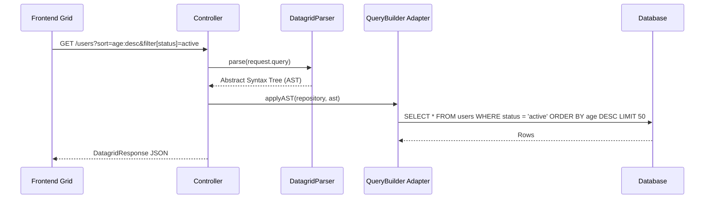

# 📊 High-Performance Datagrid API (`@ferrox-node/transports`)

## 💡 1. What It Is & Architectural Purpose
The Datagrid module is a highly specialized transport extension designed to serve massive, paginated, sortable, and filterable datasets to frontend data tables (like AG-Grid or DataTables). Its architectural purpose is to convert complex frontend grid state requests (filters, sorts, aggregations) into highly optimized SQL or MongoDB aggregation pipelines dynamically, preventing N+1 query problems.

---

## ⚙️ 2. Comprehensive Taxonomy & Key Features

| Component | Description | Use Case |
| :--- | :--- | :--- |
| **`DatagridParser`** | Translates HTTP Query Strings into generic AST. | Parsing `?sort=name:-1&filter[age][$gt]=18`. |
| **`TypeOrmGridBuilder`** | Converts AST into a TypeORM `SelectQueryBuilder`. | Fetching data securely from PostgreSQL/MySQL. |
| **`DatagridResponse`** | Standardized pagination envelope. | Returning `{ data: [], total: 100, page: 1 }`. |

---

## 🔬 3. How It Works Under the Hood



By abstracting the query language into an AST, the controller is completely decoupled from the specific query string format sent by the frontend library.

---

## 🧠 4. Why It Was Designed This Way (Rationale)

Without this module, developers often write massive `if-else` blocks in their controllers to handle every possible filter combination. This is error-prone, vulnerable to SQL injection, and impossible to maintain. The Datagrid API sanitizes and maps frontend filters dynamically, ensuring that only allowed columns can be filtered or sorted, rejecting malicious payload attempts automatically.

---

## 🚀 5. Usage Guide & Code Examples

### Exposing a Datagrid Endpoint

```typescript
import { Controller, Get, Query } from '@ferrox-node/core';
import { DatagridParser, TypeOrmGridBuilder, DatagridResponse } from '@ferrox-node/transports';
import { InjectRepository } from '@nestjs/typeorm';
import { Repository } from 'typeorm';

@Controller('/api/v1/users')
export class UsersController {
  constructor(
    @InjectRepository(User) private readonly userRepo: Repository<User>
  ) {}

  @Get('/grid')
  async getUsersGrid(@Query() query: any): Promise<DatagridResponse<User>> {
    // 1. Parse URL Query into safe AST
    const ast = DatagridParser.parse(query);
    
    // 2. Apply AST to a QueryBuilder
    const qb = this.userRepo.createQueryBuilder('user');
    const [data, total] = await TypeOrmGridBuilder.apply(qb, ast, {
      allowedSorts: ['age', 'createdAt'],
      allowedFilters: ['status', 'role'] // Security: Ignore filters on password/id
    }).getManyAndCount();

    // 3. Return Standardized Pagination Object
    return new DatagridResponse(data, total, ast.pagination);
  }
}
```

---

## ⚠️ 6. Anti-Patterns: How NOT to Use It

> [!CAUTION]
> **Anti-Pattern 1: Unrestricted Filtering**
> Never pass `allowedFilters: ['*']` or omit the security allowlist. An attacker could brute-force filter combinations to discover hidden records or cause a Denial of Service by filtering on unindexed JSON columns.

---

## 开启 7. Pro-Tips & Best Practices

> [!TIP]
> **Pro-Tip: Indexed Sorting**
> When dealing with tables > 1 Million rows, ensure that any column listed in `allowedSorts` has a dedicated B-Tree index in your database. Otherwise, the database will perform an expensive "Filesort", locking resources.
